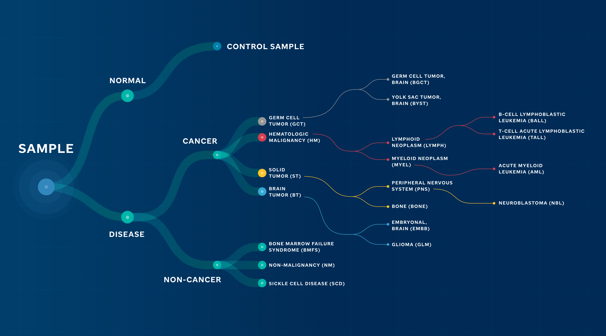

# The St. Jude Cloud Pediatric Cancer Classification Ontology: An Evolving Framework  

Click [here](https://permalinks.stjude.cloud/permalinks/st-jude-cloud-ontology) to download the full St. Jude Cloud custom ontology (v0). 

## Introduction: 

Ontologies designed for disease classification have redefined our understanding of diseases by providing a hierarchical structure of complex biomedical data. In cancer research, they are critical for data sharing, integration, and collaboration among researchers. However, existing ontologies on pediatric cancer classification are limited. The World Health Organization (WHO) and OncoTree primarily focus on adult cancers while leaving gaps in many pediatric cancer subtypes driven by molecular etiology presented in recent scientific literature. To enable data sharing and integration of the whole-genome, whole-exome and RNA-seq data generated from 13,956 cases of pediatric cancer and long-term survivors on St. Jude Cloud, we recognized the significance of such gaps and initiated the development of a tailored ontology to address this issue. 

## Principles: 

Our goal is to develop a pediatric-centric framework with the capability of integrating new research findings, including those involving rare molecular drivers. Currently, we focus exclusively on pediatric cancer but will consider extension to other childhood catastrophic diseases, such as Bone Marrow Failure and Sickle Cell disease. Our framework is designed to integrate molecular, pathological, and histological features by leveraging existing efforts from OncoTree, WHO, and community knowledge. 

## Methods/Details: 

To achieve these principles, we evaluated existing ontologies, including:  

- OncoTree 

- International Classification of Diseases for Oncology (ICD-O) 

- The World Health Organization (WHO) Hematological and CNS classifications 

  
Our primary design is based on OncoTree due to its cancer-focused approach, structure for starting at tissue and breaking out into diseases, and alignment with our guiding principles. However, there have been deviations which initiated the tailored ontology that applies across St. Jude Cloud (*Figure1*). 

 
## Key Structural Changes: 

- **Adjustment in Hematological Diseases:** Distinctions between leukemia and lymphoma were introduced, addressing a gap in OncoTree's applicability to the pediatric domain. 

- **Exclusion of Adult-Specific Terms:** We omitted terms exclusive to adult diseases, such as breast cancer and lung cancer (e.g. small cell lung cancer (SCLC)) ensuring our ontology's focus primarily remains tailored to pediatric oncology. 

- **Expansion for Recently Discovered Molecular Drivers:** Recognizing the prominence of new molecular drivers discovered by genome-wide profiling of pediatric diseases, we expanded our ontology to include additional nodes to reflect the current knowledge. For instance: 

    - B-Cell Acute Lymphoblastic Leukemia (BALL)1 was subdivided into 28 distinct subtypes, a considerable increase from Oncotree's original nine. 

        - Incorporating newly discovered molecular drivers such as DUX42, MEF2D3 NUMT1 or BCL11B4 rearrangements. 

    - T-Cell Acute Lymphoblastic Leukemia (TALL)5 was classified into 10 distinct subtypes, up from two in OncoTree. 

        - Including commonly activated transcriptional regulators including those oncogenes defining T-ALL subgroups - TAL1, TLX1, TLX3, and NKX2-1.5

## Current Status:  

To date, the development was primarily motivated by omics data that was being uploaded to the St. Jude Cloud platform every month for community data sharing. At this cadence, the ontology framework represents an evolving architecture as it is continuously being refined as new data is curated. In addition to the incremental updates, major revision has been planned, with current examples described below. This is to align with recent publications, to work closely with institutional experts who are heavily involved with developing the WHO classifications, thereby updating CNS tumor classification updates from WHO CNS5, to make recent updates from OncoTree.

## Current Focus: 

 **Review of Glioma Tumors6:**

- There's a notable shift in classifying diffuse intrinsic pontine glioma to midline glioma, reflecting evolving understanding and diagnostic criteria noted by the WHO CNS5 guidelines. 

- Additionally, our ontology's inclusion of modifiers such as anaplastic or diffuse diverges from the recent WHO CNS5 classification updates for grading, particularly concerning tumors like astrocytoma and glioblastoma. 

**Review of Embryonal Tumors6:** 

- Recent studies advocate for revisiting the classification of embryonal tumors, for example medulloblastoma groups 3 and 4. Proposals suggest annotating them as Medulloblastoma, non-WNT/non-SHH7,8 emphasizing molecular distinctions over histological classifications.  

- Given the heterogeneity nature of medulloblastoma, there is a new term, histologically defined, that should be evaluated and employed for subtypes such as large cell/anaplastic or desmoplastic/nodular medulloblastoma.  

**Review of Solid Tumors9:**  

- Explore merging subtypes such as osteoblastic osteosarcoma and chondroblastic osteosarcoma under the umbrella of osteosarcoma, aligning with evolving research insights. 

## Conclusion 
Our ontology is integral to various applications within St. Jude Cloud, driving initiatives like the Genomics Platform and Pediatric Knowledge Base (PeCan). However, its growth and effectiveness rely on community involvement. The current ontology framework has been developed with the input from pathologists and researchers involved in molecular subtyping. We welcome additional input and collaboration from researchers and clinicians to ensure its ongoing improvement and relevance to pediatric oncology, ultimately contributing to better outcomes for children facing cancer and catastrophic diseases. 

 
**Contact:** For inquiries, collaborative opportunities, or to provide feedback on improving the St. Jude Cloud ontology, please contact support@stjude.cloud. 

**Figure 1: St. Jude Cloud Ontology.** High-level overview of the ontology that supports applications in St. Jude Cloud.  

### References 

1. https://pubmed.ncbi.nlm.nih.gov/36050548/ 

2.  https://pubmed.ncbi.nlm.nih.gov/27776115/  

3. https://www.ncbi.nlm.nih.gov/pmc/articles/PMC5105166/  

4.  https://pubmed.ncbi.nlm.nih.gov/36050548/  

5. https://pubmed.ncbi.nlm.nih.gov/28671688/  

6. https://academic.oup.com/neuro-oncology/article/23/8/1231/6311214  

7. https://www.biorxiv.org/content/10.1101/2024.02.09.579680v1.full 

8. https://www.ncbi.nlm.nih.gov/pmc/articles/PMC8833659/ 

9. https://ascopubs.org/doi/full/10.1200/CCI.20.00108 