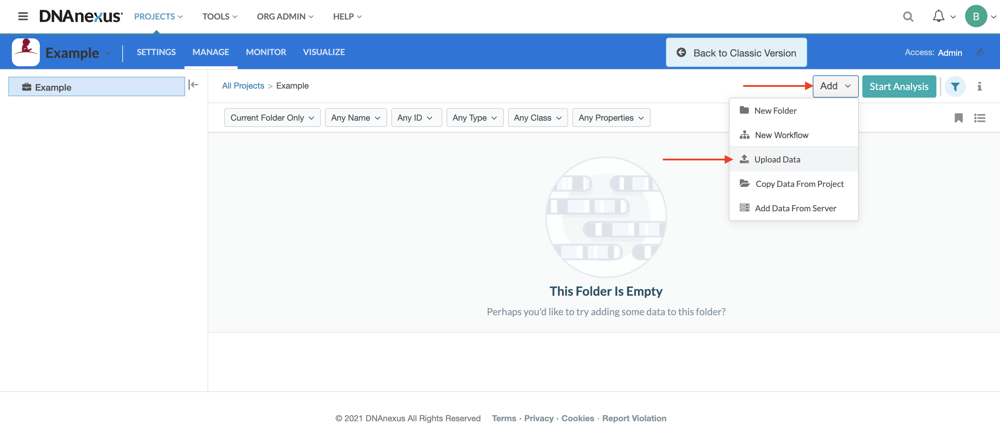
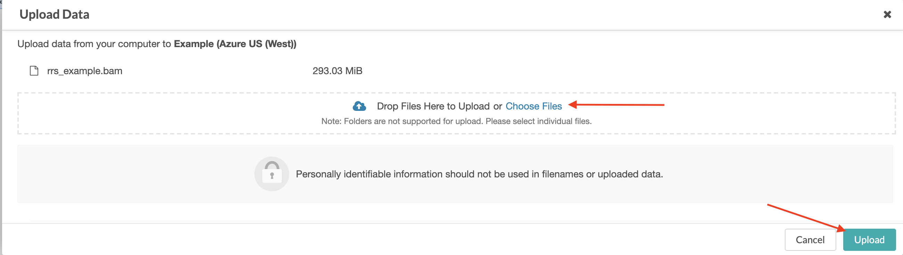
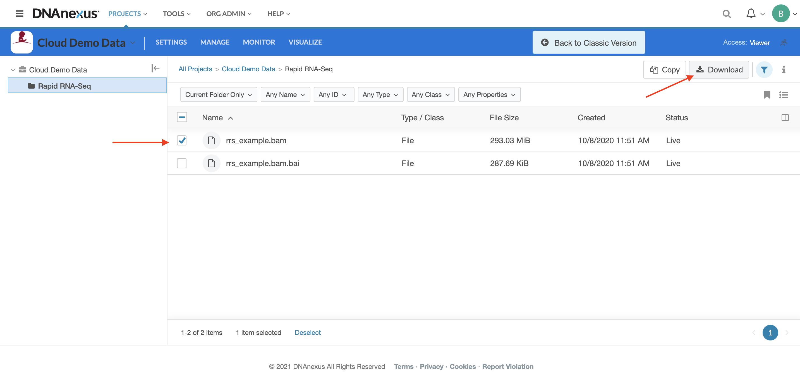
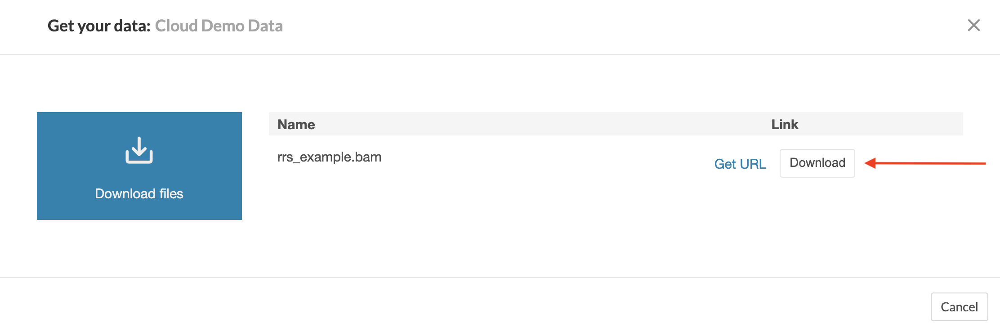
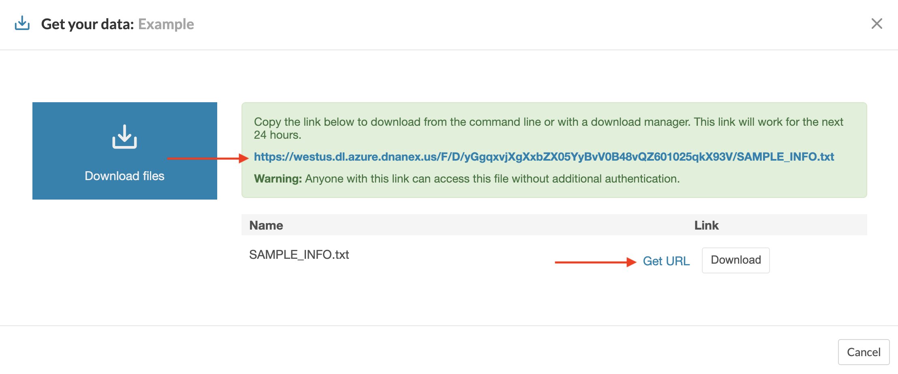

## Uploading and Downloading Data from DNAnexus 

## Uploading Data

DNAnexus allows you to upload and download data directly on their website. To upload data, first navigate to the DNAnexus project folder where you want to store the data. 

Click on the “Add” button, then from the drop-down menu select “Upload Data.” 

In the pop-up menu, either drag and drop files or select them from the navigator. Once all of the files have been added, click on the “Upload” button.

## Downloading Data

To download data using the DNAnexus website interface, first navigate to the folder where the files are located. 

Select all files to be downloaded by checking the boxes next to the file.

Click on the “Download” button from the list above.

Finally, click on “Download Files” in the following menu.

Alternatively, click on the “Get URL” to create a URL link which can be used to download the data. 

Warning: This link can be shared with others to allow them access to the data, but the link does not require additional authentication to use. Use caution when sharing and remember that downloading St. Jude Cloud data is only allowed if the appropriate section of the Data Access Agreement has been submitted and approved.

