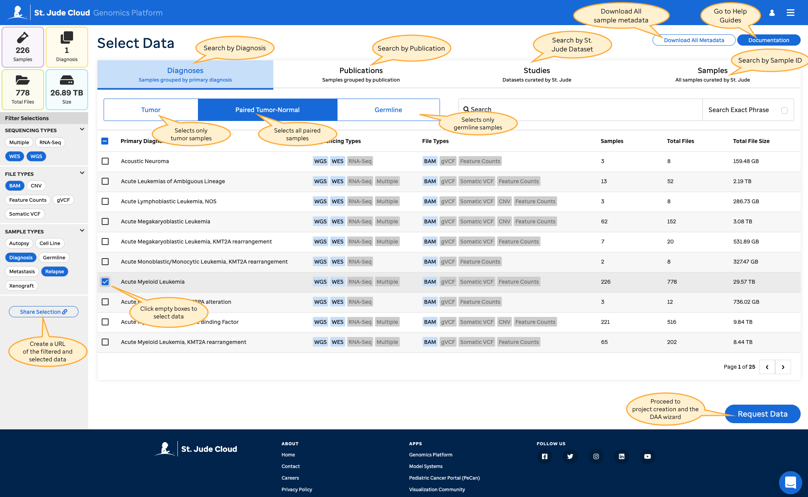

## Request Process Overview
   
Creating a data request is the premier way to access raw St. Jude next generation sequencing data in the cloud. You can get a **free** copy of the data in a secure cloud environment powered by [Microsoft Azure](https://azure.microsoft.com/en-us/) and [DNAnexus](https://www.dnanexus.com/), or you can elect to download the data to your local computing environment.

<iframe 
    width="560" 
    height="315" 
    src="https://www.youtube.com/embed/i9bJJ5uA_fY" 
    title="YouTube video player" 
    frameborder="0" 
    allow="accelerometer; autoplay; clipboard-write; encrypted-media; gyroscope; picture-in-picture" allowfullscreen>
</iframe>

!!!warning For-Profit Companies
St. Jude Cloud does not allow for-profit companies to access any restricted access genomics data. We are actively working with our institution to assess the feasibility of providing data to for-profit entities. If you work for a for-profit company and would like to be notified if this restriction changes, feel free to email us at [support@stjude.cloud](mailto:support@stjude.cloud).
!!!

#### Helpful Things to Remember

1. Data in St. Jude Cloud is grouped into [Data Access Units (DAUs)](../glossary/#data-access-unit), which usually correspond to large-scale sequencing initiatives at St. Jude. 
2. Individuals can [apply for access](../glossary/#data-access-agreement) to DAUs on a case-by-case basis for a specific amount of time (1 year, with the opportunity to extend access).
3. Access to data in a given DAU is assessed by the corresponding [Data Access Committee](../glossary/#data-access-committee) who reviews a variety of factors to grant access.
4. There are a number of terms of use and restrictions outlined in the [Data Access Agreement](https://platform.stjude.cloud/api/v1/data_access_agreements/). Everyone who will be working with the data must understand and agree to these terms.

## Selecting Data

The primary way to make your data selection is through our [Genomics Platform Data Browser](https://platform.stjude.cloud/data/diseases/paired-tumor-normal). You can search our raw genomic data by diagnosis, publication, study, or individual samples by selecting a tab along the top. You may further refine your search by applying filters from three categories: Sequencing Type, Sample Type, and File Type. Please note that applying multiple filters within the same category filters using 'OR' logic, while applying multiple filters across different categories filters using 'AND' logic. For example in the overview image above, we have filtered the browser to only show data that is (either WGS OR WES) AND (Diagnosis OR Relapse) AND BAM.
 
As you filter and make selections, the data summary panel in the upper left hand corner will update dynamically to give you important descriptive information about the set of data you have selected. Click on an empty box to make a selection; when selected, the box will turn blue with a white check mark. Once you have completed your data selection, click on *Request Data* to submit your request and proceed. 

<!---->

!!!note
You must have [created an account](../../accounts-and-billing) and be logged in to submit a data request. If you have not yet created an account or you are not logged in, the submit button will say *Log In* rather than *Request Data*.
!!!

Alternatively, you may be directed to the Genomics Platform Data Browser through another App to request specific samples. The [PeCan homepage](../../../pecan/#requesting-raw-genomics-through-pecan) is one such app that allows you to select data through an interactive visualization.

<!-- After clicking on *Request Data*, we ask that you review your selection and make sure that the [DAUs](../glossary/#data-access-unit) corresponding to the set of data you have selected is indeed the data you want to request. -->

<!---->

## Selecting a Project or Creating a New One

Now that you have selected your data, you need to choose whether to vend this data into an existing St. Jude Cloud project on DNAnexus, or to create a new St. Jude Cloud project. On the "Choose Your Data Destination" step, select to use an existing project and then which specific project you want to add data to, or select to create a new project.

On the "Name Your Project" step, you will see the name of the existing project you selected or a blank space to add a name for a new project. In either case, you also need to name a folder within the project. The text box will be pre-filled with "Data Requested (date)", but you are able to change it here, and also can edit any names after you have created your project.

!!!note Important Information About Vending to Existing Projects
* Within a project, if you use the name of an existing folder, the new data will be added to that folder, a duplicate named folder will not be created.
* Selected files already in the project will not be added again - there can't be duplicate files within a project, even in different folders.
* If you delete files from your project/folder, and then those files are included in a future selection, they will once again be added.
!!!

### Example Use Case

Let's quickly look at our Real-Time Clinical Genomics (RTCG) dataset as an example of how projects, folders, and files function together.

The first time you request access to RTCG from the Studies Tab of the Data Browser, you will name your new project. For this example, we'll refer to it as **RTCG Data Project**. Then you'll name the folder for this initial selection of data. Today's date will autofill, but we'll refer to the folder as **Initial Request Folder** instead. After that, complete the DAA and the rest of the process. Once you are approved, the data is delivered within your **Initial Request Folder** folder inside of **RTCG Data Project**.

The RTCG dataset is continuously updated with more Clinical Genomics data from St. Jude. When you receive an email about the latest release to the dataset, you return to the Data Browser and once again select RTCG from the Studies Tab. While you request the data, rather than create a new project, you can choose to vend data to an existing project and select **RTCG Data Project** from the dropdown menu. Now you may name a new folder to vend to. We'll call this one **New Release Folder** and submit the request. Since you already have access, there is no need to complete a new DAA or collect any signatures. There will now be two folders within your **RTCG Data Project** with the **Initial Request Folder** having most of the data, while **New Release Folder** only has the new files that have been released since the first request was made. Therefore, the new files are not found in **Initial Request Folder**.

## Completing the Data Access Agreement

!!!info 
If you already have access to the data or are requesting open-access data, you will not be prompted to go through this section.
!!!

<!--Every person who requests access to our controlled-access data must sign the [Data Access Agreement (DAA)](../glossary/#data-access-agreement). If you are located in the United States of America, you can opt in to completing the DAA through an electronic setup wizard. If you are not located in the USA, or would like to complete the form manually, you can follow our instructions on [Filling Out The Data Access Agreement](../how-to-fill-out-daa).-->

Through the Electronic Data Access Agreement wizard, you will add all of the necessary information needed for the [Data Access Agreement (DAA)](../glossary/#data-access-agreement). Once you have completed the setup wizard, if you are located in the United States of America, you can opt in to using DocuSign to collect the required signatures - the form will be sent to you and necessary signatories through email via [DocuSign](https://www.docusign.com). If you are not located in the USA, or would like to complete the form manually, you will print the DAA and collect signatures manually, then upload and submit the request. You can learn more about [Filling Out The Data Access Agreement here](../how-to-fill-out-daa).

!!!info Planning to Download?
If you would like to download the data to local storage, there are extra steps you'll need to follow such as [getting additional signatures](../how-to-fill-out-daa/#data-download-permission) on your data access agreement. We recommend that you work with the data in the cloud if it's feasible; the data provided by St. Jude is free, the compute charges are reasonable, and working in the cloud helps to eliminate the long, error-prone download process. Porting your tools to be run in the cloud is easy as well. We recommend you follow [this guide](../../analyzing-data/creating-a-cloud-app) to get started.
!!!

Access request approval typically takes less than 2 weeks if your data access agreement is correctly and completely filled out. You will receive automated emails from notifications@stjude.cloud when your request is approved. Note that an email for each of the Data Access Units requested is sent, and they are not all approved at once, but rather as soon as each committee grants approval. 

!!!tip 
If you receive an email from us that your DAA is incomplete, you may edit your DAA and upload the revised copy using the 'Add a Form' button the on [My Dashboard](../../managing-data/working-with-our-data/#managing-your-data-requests) page. 
!!!

## Managing your Data Request
Go to our [Managing Data Overview](../../managing-data/working-with-our-data) documentation page to learn how to check the status of your data request, complete an EDAA draft, upload a revised DAA, and ultimately access your data from your [My Dashboard](https://platform.stjude.cloud/requests/manage) page.

