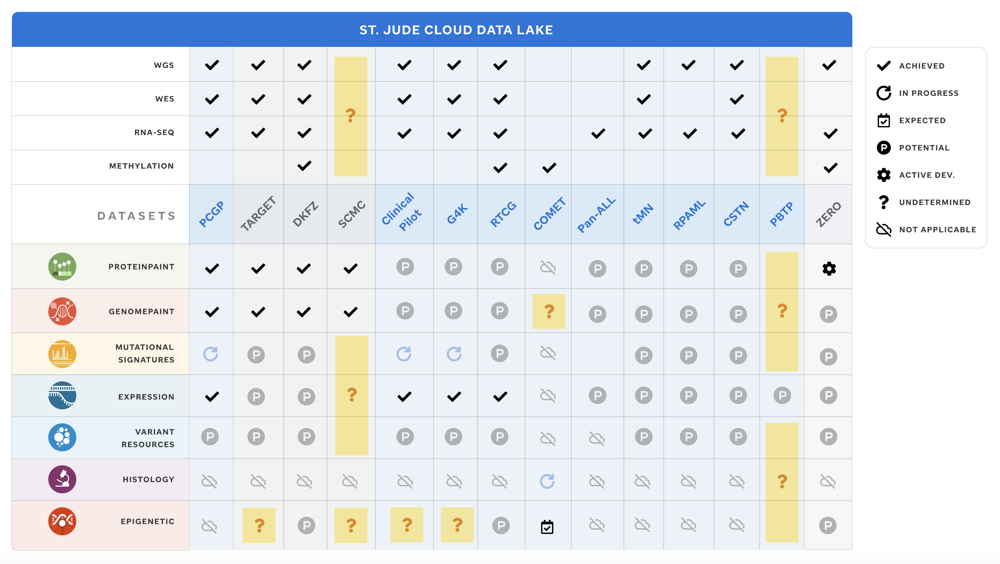

This is a draft and needs to be updated:

**MISSING IN TABLE:
UTSMC
MAGIC
UTSW
BROAD
DKTK
SGP
SJLIFE**

# GenomePaint 
The Pediatric2 dataset expanded the original Pediatric dataset with non-coding variants and expression data in GenomePaint. The additional data includes Genome for Kids (PMID: [34301788](https://pubmed.ncbi.nlm.nih.gov/34301788/)), Shanghai Children's Medical Center relapsed ALL cohort (PMID: [32632335](https://pubmed.ncbi.nlm.nih.gov/32632335/)), St Jude's Clinical cancer genomic profiling by three-platform sequencing study (PMID: [30262806](https://pubmed.ncbi.nlm.nih.gov/30262806/)), and St Jude's Pan-neuroblastoma analysis data study (PMID: [33056981](https://pubmed.ncbi.nlm.nih.gov/33056981/)).

| Ref Genome | Dataset            |
| ---------- | ------------------ |
| hg19       | Pediatric, PAN-ALL |
| hg38       | Pediatric, SJLIFE  |

**Table 1.** GenomePaint datasets. (hg19) Pediatric, PAN-ALL versus (hg38) Pediatric, SJLIFE data sets available. 

# ProteinPaint
The Pediatric dataset consists of somatic variants and tumor RNA-seq data shown in the protein view. The dataset is comprised of the GRCh37/hg19 genome as well as data from the Pediatric Cancer Genome Project ([PCGP](https://permalinks.stjude.cloud/permalinks/pcgp)), NCI Target cohort, the Pan-TARGET study (PMID: [29489755](https://pubmed.ncbi.nlm.nih.gov/29489755/)), and the Shanghai Children's Medical Center T-ALL cohort (PMID: [32632335](https://pubmed.ncbi.nlm.nih.gov/32632335/)). A liftover of genomic variants and gene internals created the GRCh/hg38 dataset.

The NCI's Genomic Data Commmons ([GDC](https://gdc.cancer.gov/about-gdc)) coagulates data from NCI-supported programs, such as TCGA and TARGET.

The [Clinical Interpretation of Variants in Cancer](https://civicdb.org/) is "an open-source platform for crowdsourced and expert-moderated cancer variant curation." Supported by the NIH, NHGRI, and NCI, CIViC is a richly curated oncology dataset (PMID: [28138153](https://pubmed.ncbi.nlm.nih.gov/28138153/)).

| Ref Genome | Dataset                           |
| ---------- | --------------------------------- |
| hg19       | Pediatric, COSMIC, ClinVar, CIViC |
| hg39       | Pediatric, GDC, COSMIC, ClinVar   |

**Table 2.** ProteinPaint dataset. (hg19) Pediatric, COSMIC, ClinVar versus (hg38) Pediatric, GDC, COSMIC, ClinVar. 

 

