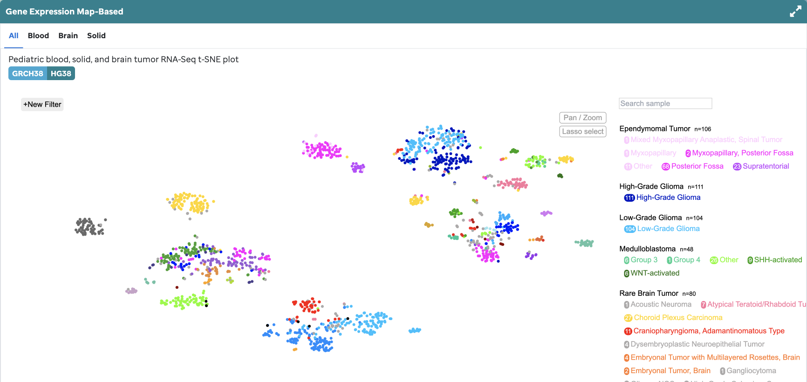
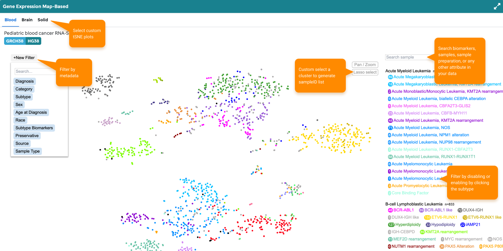
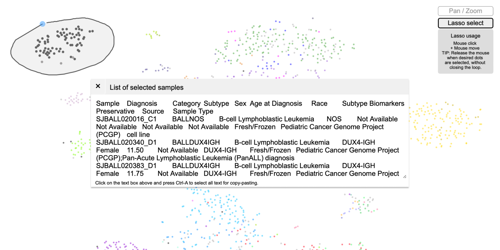

**Overview:** The expression landscape of XXXXX RNA-Seq fresh frozen tumor samples (X blood cancers, X solid tumors, and X brain tumors) in St. Jude Cloud is displayed via a t-SNE plot (**Figure 1**) generated using the [St. Jude Cloud RNA-Seq Expression Analysis workflow](https://platform.stjude.cloud/workflows/rnaseq-expression-classification). 

!!!tip
An example with a subset of this data can be found in [Figure 4f of McLeod et al](https://cancerdiscovery.aacrjournals.org/content/11/5/1082.long).
!!!

**Figure 1: tSNE for Blood, Brain, and Solid Samples.** Further details for each sample can be accessed by mousing over the dots and by accessing the associated [metadata](https://platform.stjude.cloud/api/v1/manifest). This visualization is supported by ProteinPaint's scatterplot.

!!!note
All samples use the hg38 reference genome.
!!!

**Features:**
A user can toggle between the 4 tSNE plots: all samples, Blood, Solid, or Brain tumor samples and employ the features listed below (**Figure 2**). 

*Subtype selection*- Diagnosis subtypes are denoted by color as per the legend (right).

*Filter* - Diagnosis, catergory, subtype, sex, age, etc can filter the samples in the plot.

*Search* - A user can search individual samples, subtypes, subtype biomarkers, sample cohort, sample preparation, etc.

*Lasso* - Allows a user to select a specific region on the plot to retrieve a list of samples to enable further investigation.

*Pan/Zoom* - Allows a user to examine regions of the plot in more detail.

**Figure 2: Features for tSNE.** A user can interact by using a number of features for each of the 4 tSNE plots. 

To explain further, the lasso enables a user to select a region on the plot to enable further investigation with the sampleIDs selected (**Figure 3**)

**Figure 3: Lasso.** A user can use the lasso feature to populate a table to retrieve a list of sampleIDs for the selected region.
