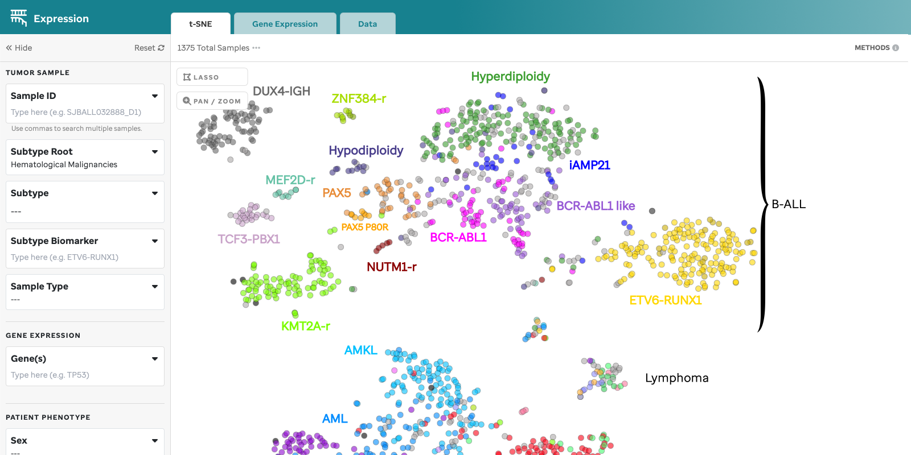
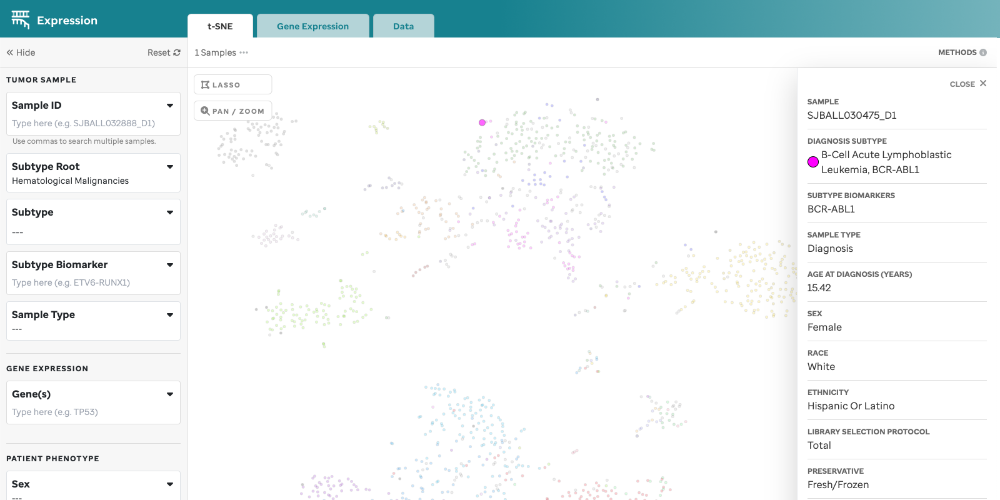
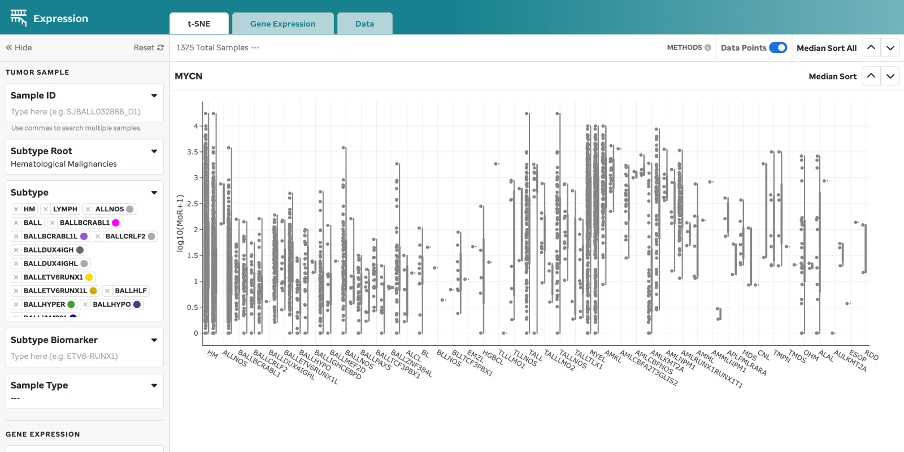
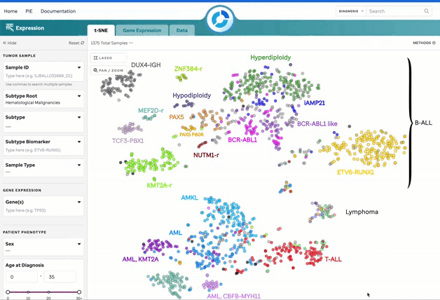
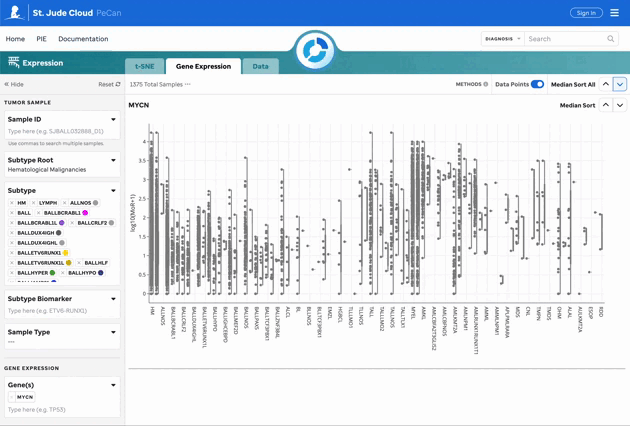
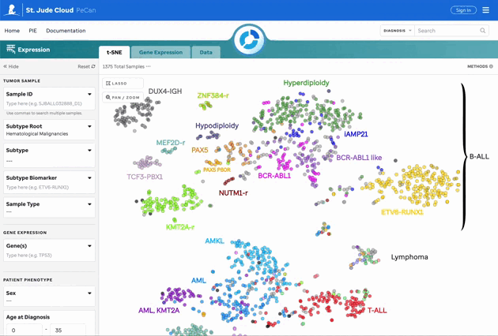

## Overview

This facet comprises three tabs, allowing users to explore the expression landscape of 3,432 RNA-Seq fresh frozen tumor samples (1,389 blood tumors, 888 solid tumors, and 1,155 brain tumors) using a t-SNE plot (**Figure 1**), gene expression violin plots organized by subtype for a gene of interest (**Figure 2**), gene expression overlayed on the t-SNE, or collectively within a data matrix.

**Figure 1: t-SNE for Blood, Brain, and Solid Samples.** Mouse over data points to access metadata details for each sample. Visualization powered by D3.

**Figure 2: Gene Expression for TP53.** Gene expression violin plots for each sample, filtered by the gene of interest. Visualization powered by Plotly.

> **Note**
> - All samples use the hg38 reference genome.
> - Full metadata can be accessed through our [manifest](https://platform.stjude.cloud/api/v1/manifest).

---

## Features for the t-SNE Plot

| Feature             | Description                                                                                                               |
|---------------------|---------------------------------------------------------------------------------------------------------------------------|
| **Subtype Categorization** | Subtypes are color-coded, and a subset is labeled on the plot. These can be turned off in the 3 dot menu.          |
| **Sample Summary**   | Clicking a data point opens a drawer with metadata and sample details.                                                    |
| **Filters**          | Filters are categorized by Tumor Sample, Patient Phenotype, and Sample Preparation.                                        |
| **Sample Search**    | Search by individual or bulk (comma-separated) sample IDs. CompBio IDs must be exact.                                      |
| **Lasso Tool**       | Select a region on the plot to retrieve a list of samples for further investigation.                                       |
| **Pan/Zoom**         | Zoom in or pan to examine specific regions of the plot. This will disable subtype labels.                                 |

> **Warning**
> Filtering by the sunburst will auto-populate the Root and Subtype filters. These can be manually edited but will not update the sunburst.

---

## Features for Gene Expression

| Feature                   | Description                                                                                                         |
|----------------------------|---------------------------------------------------------------------------------------------------------------------|
| **Gene Sandbox**           | Violin plots for the gene of interest, filtered by root and subtypes.                                                |
| **Plotly Functions**       | Pan and zoom features on the right side of the gene sandbox do not affect filter components.                         |
| **Median Sort**            | Sort the gene expression sandboxes by median expression across or within individual groups.                          |
| **Outlier Toggle**         | Toggle off data points to keep outliers intact for the cohort currently being filtered.                              |

For data normalization details, refer to our [Methods and Data](https://university.stjude.cloud/docs/pecan/methods-data/) page.

---

## Gene Expression Overlay on t-SNE

Users can overlay gene expression on the t-SNE plot by selecting genes of interest. Count data is normalized using Median of Ratios (MoR). More details can be found on the [Methods and Data](https://university.stjude.cloud/docs/pecan/methods-data/) page.

---

## Features for the Data Matrix

The data matrix displays all filtered data with sortable headers for easier exploration.

Coming soon!

---

## Filters Explained

### Tumor Sample

| Filter                 | Description                                                                                                                                      |
|------------------------|--------------------------------------------------------------------------------------------------------------------------------------------------|
| **Sample ID**           | Search by individual or bulk St. Jude CompBio IDs (comma-separated). Allows multi-select.                                                       |
| **Subtype Root**        | Custom-select a root to prompt applicable subtypes. Heme is defaulted upon loading the facet unless the sunburst is employed.                   |
| **Subtype**             | Custom-select subtypes to view on the plot. Parent node selection enables or disables child nodes.                                               |
| **Subtype Biomarker**   | Multi-select subtype biomarkers to apply on the plot. General genes like "CTNNB1" are not accepted; users must select biomarkers from dropdown. |
| **Sample Type**         | Multi-select dropdown for sample types.                                                                                                         |

### Patient Phenotype

| Filter                | Description                                                                 |
|-----------------------|-----------------------------------------------------------------------------|
| **Sex**               | Multi-select dropdown for biological sex.                                   |
| **Age at Diagnosis**   | Adjustable scale or manual input for age in years.                         |
| **Race**              | Multi-select dropdown for race.                                             |
| **Ethnicity**         | Multi-select dropdown for ethnicity.                                        |

### Sample Preparation

| Filter                        | Description                                |
|-------------------------------|--------------------------------------------|
| **Library Selection Protocol** | Multi-select dropdown for library protocol types.  |
| **Preservative**               | Multi-select dropdown for sample preservative types. |

> **Warning**
> Some fields may have a "Not Available" option for samples where the data wasn't recorded (e.g., Race, Ethnicity, Sex).

> **Tip**
> For a subset of this data, refer to [Figure 4f of McLeod et al.](https://cancerdiscovery.aacrjournals.org/content/11/5/1082.long)

---

To see how the data was calculated and normalized, visit our [Methods and Data](https://university.stjude.cloud/docs/pecan/methods-data/) page.
