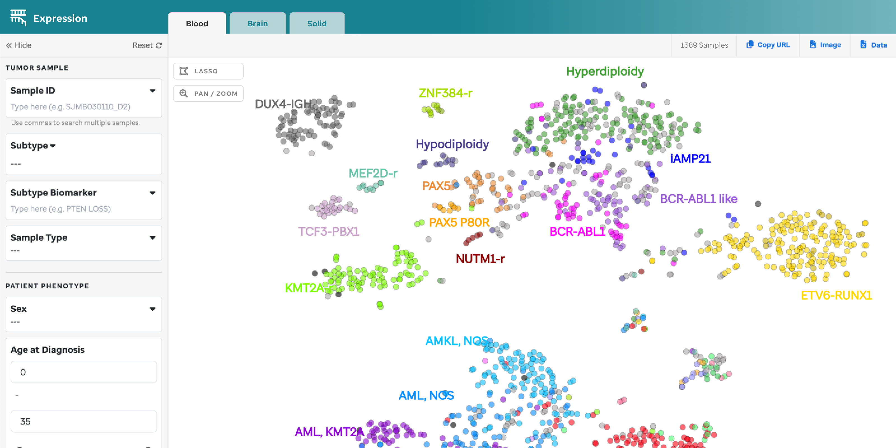

**Overview:** The expression landscape of 3432 RNA-Seq fresh frozen tumor samples (1389 blood tumors, 888 solid tumors, and 1155 brain tumors) in St. Jude Cloud is displayed via a t-SNE plot (**Figure 1**) generated using the [St. Jude Cloud RNA-Seq Expression Analysis workflow](https://platform.stjude.cloud/workflows/rnaseq-expression-classification).

**Figure 1: tSNE for Blood, Brain, and Solid Samples.** Metadata details for each sample can be accessed by mousing over the data points. This visualization is supported by D3.

!!!note
- All samples use the hg38 reference genome.
- All metdata can be found by accessing our [manifest](https://platform.stjude.cloud/api/v1/manifest)
!!!

**Features:**
A user can explore across the 3 tSNE plots: Blood, Solid, or Brain tumor tabs and employ the features listed below:

*Subtype categorization*- Subtypes are denoted by a specific color and a subset have been labeled on the plot.

*Sample Summary*- A user can select a data point on the plot that opens a sample summary drawer annotating relavent metadata and information. 

*Filters* - Filters are organized by Tumor Sample, Patient Phenotype, and Sample Preparation. Once a filter is selected, the subtype labels will be disabled. Functionality of each is further described below. 

*Sample Search* - A user can search individual sampleIDs or bulk IDs that are comma separated. The sampleIDs must be exact and cannot be fuzzy searched.

*Lasso* - Allows a user to select a specific region on the plot to retrieve a list of samples to enable further investigation. To view the sample summary of the lassoed samples, click the "Data" icon in the top right of the subnavbar. See GIF below.

*Pan/Zoom* - Allows a user to examine regions of the plot in more detail, this disables any labels. 

!!!warning
Filtering by the sunburst will auto-populate the diagnosis and subtype filter. A user can edit this modal, but it will not update the sunburst.
!!!

**Filters Explained**

### Tumor Sample

1. Sample ID - A user can search individual St. Jude CompBio IDs or bulk search IDs that are comma separated. This field allows for a multi-select. 
2. Subtype - This is a modal whereby a user can custom select which subtypes to view in the plot. Child nodes will automatically become enabled or disabled if a parent node is (de)selected. The number of samples and the subtype color is desginated in the modal for reference. 
3. Subtype Biomarker - This field allows a multi-select of subtype biomarkers to be applied to the plot. *Note: the user cannot apply a general gene like "CTNNB1" to be applied across the plot. The user must select all biomarkers they are interested in seeing from the dropdown*
4. Sample Type - This field is a multi-select dropdown. 

### Patient Phenotype

1. Sex - A multi-select dropdown. 
2. Age at Diagnosis - A scale whereby a user can manually type in the age parameters or use the scale (in years). A user can type in any age, even passed our "35+" parameter. 
3. Race - This is a multi-select dropdown.
4. Ethnicity - This is multi-select dropdown.

### Sample Preparation

1. Library Selection Protocol - This is a multi-select dropdown.
2. Preservative - This is a mutli-select dropwdown 

!!!warning
There can be fields with a "Not Available" option for samples that did not have this value recorded (e.g., Race, Ethnicity, Sex). 
!!!

!!!tip
An example with a subset of this data can be found in [Figure 4f of McLeod et al](https://cancerdiscovery.aacrjournals.org/content/11/5/1082.long).
!!!