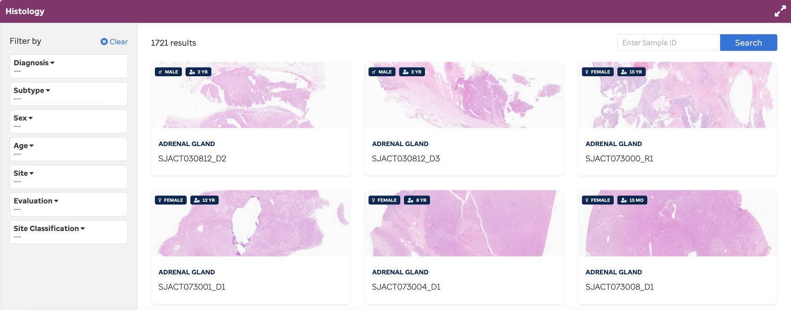
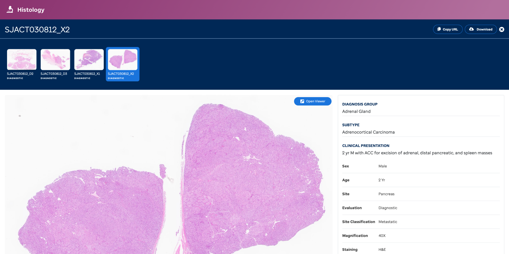
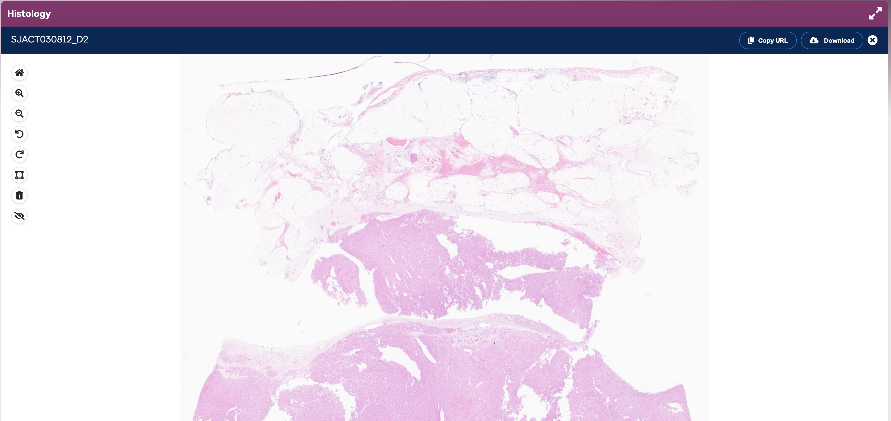

**Overview:** Explore over X000 histology slides (H&E stained) that have been harmonized to our ontology disease hierarchy.

**ADVANCED SEARCH** - The Histology homepage (**Figure 1**) will comprise an advanced search page enabling filtering of slides via metadata--diagnosis, subtype, sex, age, site, evaluation, site classification-- via drop-down lists. The return provides thumbnails with minimum data about the slide (e.g., subtype, sex, age, and SJID). Sample IDs can be searched individually.

**Figure 1:** Advanced search. A user can select Diagnosis/Subtype and other fields to filter the database of histology slides.

**SAMPLE SLIDE IMAGE**
This view (**Figure 2**) enables access to each histology slide via a “sample slide page" with the associated clinical report data. Additionally, if a slide is associated to a patient with multiple slides across time, the user can easily toggle between the images (*see **Figure 2** below*). Further, the user can copy the URL to share, or download the slide (`.svs` format) for further investigation.

**Figure 2:** Sample Slide Image. Preview of the slide with clinical report data. Some slides will display a timeline at the top which is interactive to toggle between slides.

**OPEN SLIDE VIEWER**
This view (**Figure 3**) enables the exploration of a sample slide via a slide image viewer page supported by OpenSeaDragon (feature listed below).

**Features:**
*Home*: refreshes the slide to the original state
*Magnify+*: Zoom in
*Magnify-*: Zoom out
*Rotate left*: rotates slide left by 90 degrees
*Rotate right*: rotates slide right by 90 degrees
*Slidescale*: scale shows dimension

**Figure 3:** OpenSeaDragon Analysis. Using the OpenSeaDragon functionality enables deep exploration within the slide.

