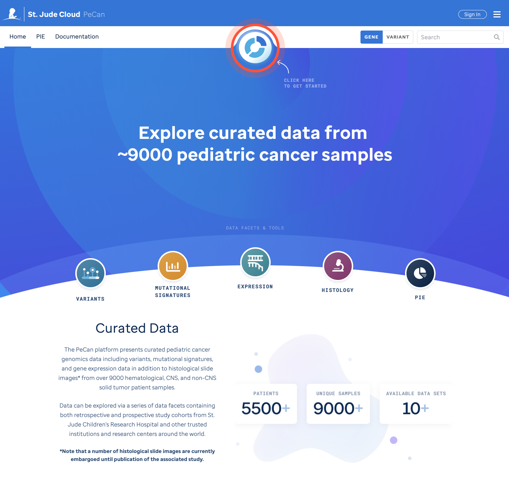
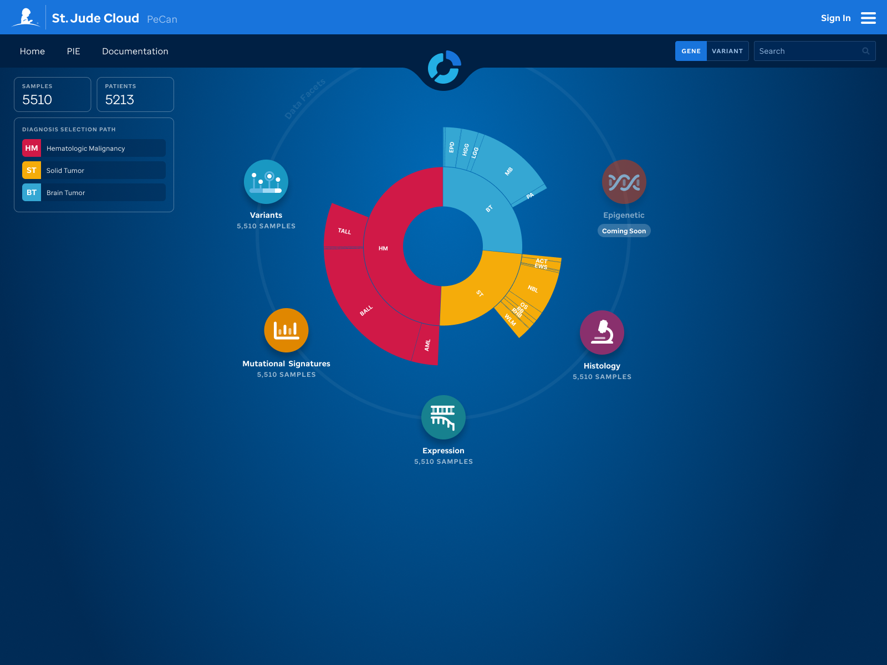

The PeCan platform presents curated pediatric cancer genomics data including variants, mutational signatures, and gene expression data in addition to histological slide images from over 9000 hematological, CNS, and non-CNS solid tumor patient samples.

Data can be explored via a series of data facets containing both retrospective and prospective study cohorts from St. Jude Children's Research Hospital and other trusted institutions and research centers around the world such as [TARGET](https://ocg.cancer.gov/programs/target), [DKFZ](https://www.dkfz.de/en/index.html), and many others. Learn more about the data [here](https://university.stjude.cloud/docs/pecan/data/).

# Homepage
The [PeCan homepage](https://pecan.stjude.cloud/home) showcases key components for each of the 4 data facets --Variants, Mutational Signatures, Expression, and Histology--, the tool: PIE (Pediatric Cancer Variant Information Exchange), and coming soon features.

To get started (**Figure 1**), click our navigational membrane which navigates the user to our Sunburst and data facets or search a gene or variant.

**Figure 1: HomePage.** A user can become familiar by reading the key components that is offered in PeCan Knowledgebase. Additionally, a user can navigate by using our navigational membrane or begin searching a gene or variant.

# Sunburst
The sunburst plot gives an at-a-glance disease distribution and disease hierarchy where all samples have been mapped to a WHO pediatric cancer classification based ontology (**Figure 2**).
This interactive interface updates as a user selects a diagnoses or subtype within in the sunburst. For example, the samples available per the selection will be provided for the applicable data facet. Additionally, the number of smaples and patients along with the diagnosis path will update as a user navigates through the sunburst. 

The diseases are categorized in three main root categories: **1)** HM -Hematopoietic Malignancies, **2)** BT -Brain Tumor, and **3)** ST -Solid Tumor. A user is encouraged to navigate via a subtype-centric experience by selecting a subtype and then navigate to each data facet for that available data. This will enable custom interface views per data facet based on the sunburst selection. Alternatively, a user can explore all of the available data within a data facet by clicking directly on the data facet icon instead of filtering by subtype on the sunburst.

[Click here](../genomics-platform/requesting-data/about-our-data/#short-disease-code-mapping) for a full mapping of disease codes or [here](http://localhost:8000/docs/pecan/methods-data/) to learn more about our data and methods.

**Figure 2: Sunburst Interfacet.** A user is able to filter by diagnoses and/or subtype by selecting the interactive sunburst or by navigating directly into a data facet for the available data.

# Data Facets explained
Data Facets represent a distinct type of post-processed genomic data for collections of pediatric cancer samples via a designated interface.

  

    
  

  

    <h5 class="font-bold"><a href="https://university.stjude.cloud/docs/pecan/variants/"class="text-blue-primary">Variants</a></h5>
    
Visualizations to showcase variant data in an Oncoprint format, Variant Prevalence display, GenomePaint view, ProteinPaint view and designated variant details pages.

  

  

    
  

  

    <h5 class="font-bold"><a href="https://university.stjude.cloud/docs/pecan/mut-sigs/"class="text-blue-primary">Mutational Signatures</a></h5>
    
Samples depicted via a heatmap where COSMIC mutational signatures in pediatric cancer subtypes were analyzed by WGS.

  

  

    
  

  

    <h5 class="font-bold"><a href="https://university.stjude.cloud/docs/pecan/expression/"class="text-blue-primary">Expression</a></h5>
    
An expression landscape of RNA-Seq fresh frozen tumor samples.

  

  

    
  

  

    <h5 class="font-bold"><a href="https://university.stjude.cloud/docs/pecan/histology/"class="text-blue-primary">Histology</a></h5>
    
Solid tumor samples that have histology imaging (all H&E).

  

  

    
  

  

    <h5 class="font-bold"><a href="https://university.stjude.cloud/docs/pecan/epigenetic/"class="text-blue-primary">Epigenetic <small>(coming soon)</small></a></h5>
    
Solid tumor samples with methylation profiling that have linked histology images.

  

# Tools

  

    
  

  

    <h5 class="font-bold"><a href="https://university.stjude.cloud/docs/pecan/pie/"class="text-blue-primary">PIE (the <strong>Pe</strong>diatric <strong>Can</strong>cer Variant <strong>P</strong>athogenicity <strong>I</strong>nformation <strong>E</strong>xchange</a></h5>
    
is a cloud-based variant classification and interpretation service.

  

!!!tip
Looking for the legacy PeCan Help Guides? [Go here.](https://university.stjude.cloud/docs/legacy)
!!!