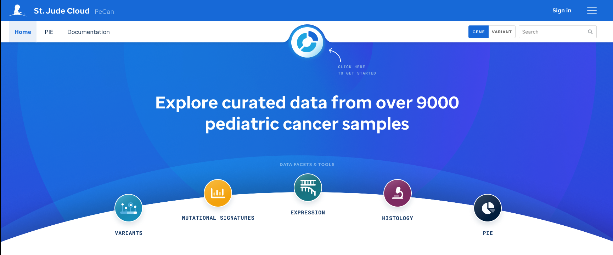

The PeCan platform presents curated pediatric cancer genomics data including variants, mutational signatures, and gene expression data in addition to histological slide images from over 9000 hematological, CNS, and non-CNS solid tumor patient samples.

Data can be explored via a series of data facets containing both retrospective and prospective study cohorts from St. Jude Children's Research Hospital and other trusted institutions and research centers around the world such as [TARGET](https://ocg.cancer.gov/programs/target), [DKFZ](https://www.dkfz.de/en/index.html), and many others. Learn more about the data [here](https://university.stjude.cloud/docs/pecan/data/). 

# Homepage 
The [PeCan home page](https://pecan.stjude.cloud/home) showcases key components for each of the 4 data facets --Variants, Mutational Signatures, Expression, and Histology--, the tool: PIE (Pediatric Cancer Variant Information Exchange), and coming soon features. 

To get started, click our navigational membrane which navigates the user to our Sunburst and data facets or search a gene or variant. 

# Sunburst
The sunburst plot gives an at-a-glance disease distribution and disease hierarchy where all samples have been mapped to a WHO pediatric cancer classification based ontology.
As a user selects a subtype within in the sunburst, the patients and samples total will update along with the diagnosis selection as well as the samples available for each facet.

The diseases are categorized in three main root categories: 1) HM -Hematopoietic Malignancies, 2) BT -Brain Tumor, and 3) ST -Solid Tumor. A user is encouraged to navigate via a subtype-centric experience by selecting a subtype and then navigate to each data facet for that selected data. Alternatively, a user can explore all of the available data within a data facet by clicking directly on the data facet icon instead of filtering by subtype on the sunburst. 

[Click here](../genomics-platform/requesting-data/about-our-data/#short-disease-code-mapping) for a full mapping of disease codes or [here](http://localhost:8000/docs/pecan/methods-data/) to learn more about our data and methods.

# Data Facets explained
Data Facets represent a distinct type of post-processed genomic data for collections of pediatric cancer samples via a designated interface.

**[Variant Resources](https://university.stjude.cloud/docs/pecan/variant-resources/)** - visualizations to showcase variant data in an oncoprint format, variant prevalence display, GenomePaint view, ProteinPaint view and designated variant details pages.

**[Mutational Signatures](https://university.stjude.cloud/docs/pecan/mut-sigs/)** - samples depicted via a heatmap where COSMIC mutational signatures in pediatric cancer subtypes were analyzed by WGS. 

**[Expression](https://university.stjude.cloud/docs/pecan/expression/)** - an expression landscape of RNA-Seq fresh frozen tumor samples.

**[Histology](https://university.stjude.cloud/docs/pecan/histology/)** - solid tumor samples that have histology imaging (all H&E).

**[Epigenetic (coming soon)](https://university.stjude.cloud/docs/pecan/epigenetic/)** - solid tumor samples with methylation profiling that have linked histology images.

# Tools
Pecan [PIE (the **Pe**diatric **Can**cer Variant **P**athogenicity **I**nformation **E**xchange)](https://university.stjude.cloud/docs/pecan/pie/) is a cloud-based variant classification and interpretation service. 