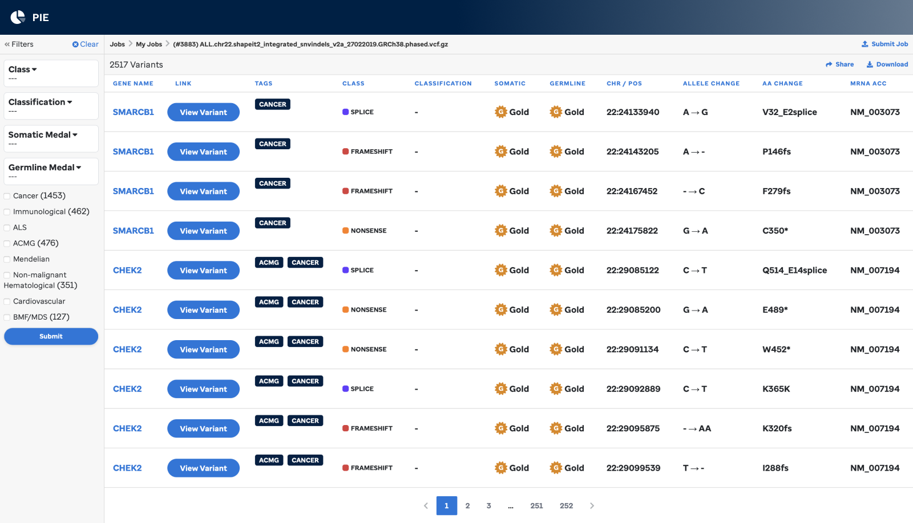

|                       |                                                                                          |
| --------------------- | ---------------------------------------------------------------------------------------- |
| **Authors**           | Michael Edmonson, Aman Patel                                                             |
| **Publication**       | [Edmonson et al., Genome Research 2019](https://genome.cshlp.org/content/29/9/1555.full) |
| **Technical Support** | [Contact Us](https://stjude.cloud/contact)                                               |


Pecan PIE (the **Pe**diatric **Can**cer Variant **P**athogenicity **I**nformation **E**xchange) is a cloud-based variant classificationand interpretation service. It annotates and ranks variants by putative pathogenicity, then displays them in an interactive web interface for formal review and classification following [ACMG guidelines](https://www.ncbi.nlm.nih.gov/pubmed/25741868). The portal also contains a repository of expert-reviewed germline mutations that may predispose individuals to cancer. It is free for non-commercial use.

Pecan PIE utilizes St. Jude Medal Ceremony, the same pipeline that powers our clinical and research genomics projects. Medal Ceremony provides a 3-level ranking of putative pathogenicity - Gold, Silver or Bronze - for mutations within disease-related genes. Medal assignment is based on matches to 22 mutation databases, mutation type, population frequency, tumor suppressor status and predicted functional impact. The evidence used for medal assignment is imported into an interactive variant review page where an analyst can enter additional curated information such as primary diagnosis, presence of subsequent neoplasm, family history and related literature. Classification tags can be assigned to curated data enabling automated calculation of pathogenicity rating based on ACMG/AMP 2015 guidelines.

See [<i class="material-icons material-icons-sjcloud-custom">file_download</i> PowerPoint slides](../../files/guides/tools/pecan-pie/pecanpie_ASHG_2017.pptx)
presented at the ASHG 2017 annual meeting (note that some of this information is out of date, various improvements have been made since
then).

## Overview


**Figure 1 PIE workflow.** An overview diagram of the Pecan PIE workflow.

### Steps
1. Log in and upload a VCF of SNVs and indels.
2. The portal will process your variants, notifying you upon completion. Variants are annotated with VEP+ (VEP with postprocessing for enhanced splice variant calling) then classified with Medal Ceremony.
3. Browse results, which include a detailed page for each variation. Variants may be formally classified with an interface based on ACMG guidelines.

## Getting started

Start by logging into the portal with a DNAnexus account, creating an account if you need one. PIE uses DNAnexus as a secure cloud backend. Logging in is required for private storage of your data and so that we can send you e-mail notifications when your analysis jobs are complete. PIE is free for non-commercial use. St. Jude pays the (small) cloud
computing costs, your DNAnexus account will not be billed.

## Uploading data or input signle variants

Pecan PIE takes standard VCF files as input, which may be either uncompressed or compressed with `bgzip`.

1. Click the "Submit a job" button. Click the VCF tab.
2. Choose the genome your variants were mapped to, which may be either GRCh37-lite or GRCh38.
3. Drag and drop your file (or upload from your computer).

OR

4. Click "Single Variant" tab and choose whether you want to input a SNV, INDEL or HGVS annotation.

## Advanced options (available only with VCF files)

The "Advanced option" panel lets you customize the behavior of the pipeline for your VCF file only:

* Gene list: Pick a gene list from the pulldown. This filters your variants to genes in the specified list. This option is required and turned on automatically if your uploaded file is 2 megabytes or larger. See the[frequently asked questions](#frequently-asked-questions) for more information. This option reduces the variant processing burden on PIE by
removing variants that will not be assigned a medal in any case because they are not on the cancer predisposition gene list. You can review the genes by clicking on the link that will appear just below the pull down titled "See gene list".
* Custom gene list: Choosing "custom" as your gene list will open a window that will let you paste in a list of genes. Any invalid genes will be dropped from your list automatically. You can separate your genes by spaces or new lines.
* Max Population frequency: PIE by default will not call medals for variants present in the ExAC (ex-TCGA) database at an allele frequency greater than 0.001. This option lets you override the filtering threshold to whatever frequency you prefer. To disable filtering altogether, specify a value of 1.

## Progress page

After uploading is complete you will be taken to a status screen showing the progress of your job through the system. Analysis typically takes 10-15 minutes depending on file size and system availability.

It isn't necessary to keep your browser open on this page until your esults are ready: the system will e-mail you with a link to return toyour results. Optional browser notifications are also available.

## Analysis of Results

### Results browser

When your job is complete you will be taken to an overview page wherevou can browse your results and examine a detailed results page for each variant. Each header can be clicked for sorting.



The variants in the results can be filtered by:

| Filter                   | Meaning                                                                                                                                                     |
| ------------------------ | ----------------------------------------------------------------------------------------------------------------------------------------------------------- |
| Class                    | Predicted effect of variant on protein coding, e.g. missense, nonsense, etc.                                                                                |
| Somatic medal            | Medal assigned to the variant by the somatic classifier.                                                                                                    |
| Germline medal           | Medal assigned to the variant by the germline classifier.</td>                                                                                              |
| Committee Classification | If the variant has been reviewed by the St. Jude germline variant review committee, the result will appear in this column, otherwise it will be blank.</td> |

The "search" box lets you filter the results by gene and/or amino acid change. The view is dynamically filtered to matching variants as you
type.

### Medal meaning

Medals are only assigned for coding and splice-related variants in disease predisposition genes. Germline medals are only assigned for novel variants or those present in the ExAC (ex-TCGA) database with a MAF no greater than 0.1% (0.001 expressed fractionally).


* **Gold medals** are assigned to truncations in tumor suppressor genes, hotspots derived from the COSMIC database, as well as perfect matches to variants in the IARC TP53, PCGP, ASU TERT, ARUP RET, and BIC databases.
* **Silver medals** are assigned to in-frame indels, truncations in non-tumor suppressor genes, variants predicted deleterious by damage-prediction algorithms, variants receiving a gold medal from the somatic classifier, and perfect matches to variants in the following databases: ClinVar (predicted pathogenic or likely pathogenic), RB1, LOVD, and UMD.
* **Bronze medals** are assigned to variants predicted tolerated by damage-prediction algorithms. Variants having an imperfect match to a database (i.e. different variants at the same genomic position or codon) typically receive a lesser medal.

A summary graphic can be found in slide 4 of the ASHG 2017 presentation ([download here](../../files/guides/tools/pecan-pie/pecanpie_ASHG_2017.pptx)).  For additional details see [Zhang et al., NEJM 2015](http://www.nejm.org/doi/full/10.1056/NEJMoa1508054#t=article) (supplementary appendix pp. 7-10).

### Variant page

Each variant links to a detailed variant page, which integrates data from a variety of sources. If either you or the St. Jude germline variant review committee have annotated a variant, that information will be pre-populated.

**Summary information**

The top of the page shows a summary of the variant, including its genomic and HGVS annotations, predicted effect on the protein, and somatic and germline medals. A description of the gene from Entrez follows, and a custom description or selection rationale may also be entered.

**Medal call information**

Clicking on one of the medal icons (gold, silver, bronze, unknown) or on the top of the page will show a summary of information related to the medal call.

**ProteinPaint**

An embedded version of ProteinPaint ([Zhou et al., Nat. Genet. 2016](https://www.nature.com/articles/ng.3466)) appears next, showing the variant in the context of a number of pediatric datasets including PCGP. A link is provided to the main ProteinPaint application which provides visualizations for additional datasets, including COSMIC and
ClinVar.

**ASHG pathogenicity classification**

Formal variant pathogenicity classification is supported by an interface implementing ACMG guidelines ([Richards et al., Genet Med. 2015](https://www.nature.com/gim/journal/v17/n5/full/gim201530a.html)). The analyst reviews a series of curated category tags, assigning applicable tags to the variant and optionally supplying additional information for each such as PubMed IDs and supporting evidence. The system will then compute an appropriate pathogenicity score based on the user-flagged categories. Additional free-form custom evidence can also be entered. This structured approach both helps eliminate arbitrary decision-making from the pathogenicity classification process and also constructs a concise summary of the logic and evidence supporting the final call.

**ClinVar and allele frequency**

Matches of the variant in ClinVar are also provided, along with predicted clinical significance and review status.

Allele frequencies for the variant in the PCGP (somatic and germline), NHLBI ESP 6500, and ExAC databases are presented both as fractional values and on a log10 plot. Detailed allele population breakdowns are provided for ExAC.

**Damage prediction algorithms**

Precomputed damage-prediction algorithm calls for nonsynonymous coding SNVs are presented from the dbNSFP database. Available algorithms are PolyPhen2 (HVAR), SIFT, CADD, REVEL, FATHMM, MutationAssessor, and LRT. The calls are presented in a circular diagram with entries color-coded based on the predicted severity of the result.

**Medal ceremony and linkouts**

Additional output from medal ceremony classification can also be reviewed. This is only loosely structured, additional fields here may eventually be integrated into Pecan PIE.
Links are provided to relevant dbSNP entries and other information sources.

**Final classification**

The final 5-tier ACMG classification can be selected after which the decision will be marked as reviewed. A checkbox is also available to
indicate this variant is a potential candidate for functional review.

## Standalone usage

This section is intended only for users who want to invoke Pecan PIE's underlying analysis pipelines independently on the [DNAnexus](https://www.dnanexus.com) platform. If you just want to use the Pecan PIE website you can safely ignore this section of the documentation. We assume familiarity with the DNAnexus platform. If you aren't familiar with this, DNAnexus' [quickstart guide](https://documentation.dnanexus.com/getting-started/tutorials/cli-quickstart) is a great place to start.

!!!warning
This section of the guide is only relevant to power users!
!!!

Two DNAnexus cloud application pipelines were created during the
development of Pecan PIE:

| Name           | Corresponding DNAnexus App                                                           | Description                                                                                                                                                                        |
| -------------- | ------------------------------------------------------------------------------------ | ---------------------------------------------------------------------------------------------------------------------------------------------------------------------------------- |
| VEP+           | [app-stjude_vep_plus](https://platform.dnanexus.com/app/stjude_vep_plus)             | A cloud installation of [VEP](https://www.ensembl.org/vep)</a> with improved logic for splice variant calls. Converts an input VCF of variants to annotated, tab-delimited format. |
| Medal Ceremony | [app-stjude_medal_ceremony](https://platform.dnanexus.com/app/stjude_medal_ceremony) | Additional annotation and automated variant classification. Requires a special input format which is produced by VEP+.                                                             |

### Permissions

In order to run the cloud pipelines independently, your DNAnexus account needs to be granted permissions to access them. After your initial login to St. Jude Cloud and/or Pecan PIE, these permissions will be granted automatically. A single login is required even if you just want to use the standalone pipelines rather than the Pecan PIE portal ([contact us](https://stjude.cloud/contact) if you encounter problems accessing the pipelines).

There are two methods of running pipelines on DNAnexus:

1.  **DNAnexus GUI.** DNAnexus provides a standardized graphical user interface for configurating, launching, and monitoring jobs on the cloud. Our pipelines can be run like any other DNAnexus pipeline.
2.  **Command line.** Jobs may also be invoked via the `dx` command line client. Command-line use allows submitting cloud jobs without interacting with a GUI, and so supports scripting and easier integration with local workflows. See [this section](../../genomics-platform/analyzing-data/command-line/#installation) for information on how to get set up with the `dx-toolkit`.

!!!note
The following examples demonstrate command-line usage.
!!!

### Uploading files

All input files must be uploaded onto the DNAnexus platform. When specifying files for input you can use either the DNAnexus fie IDs (e.g. `file-FBgvp680gz1bGQ5p8yZKz69g`), or the filenames if they are unique. For an idea of how to upload files to DNAnexus, see [this guide](https://documentation.dnanexus.com/user/objects uploading-and-downloading-files/small-sets-of-files/uploading-using-dx#uploading-files).

### Step 1: Running VEP+

To run the VEP+ DNAnexus app, you can use the following `dx` command with your own inputs in place of the example's:

```bash
dx run app-stjude_vep_plus -iinput_file=my_vcf.vcf -igenome_string=GRCh37-lite -igermline_reviewable_only=true
```

!!!tip
* `genome_string` must be either `GRCh37-lite` or `GRCh38`. If `GRCh38` is specified, variants will be lifted over to `GRCh37-lite` in output, i.e. the output will always be `GRCh37-lite` (Medal Ceremony currently only supports `GRCh37-lite`).
* The input VCF specified by `input_file` may be either uncompressed, or compressed with `bgzip` **only** (htslib/tabix packages).
* The `germline_reviewable_only` parameter is optional, but strongly recommended. If specified, only variants in disease-gene related intervals will be annotated, which is appropriate for Medal Ceremony. If this option is not specified all variants will be annotated, which depending on the size of your VCF might take a lot longer, and many of the resulting variants won't be usable by Medal Ceremony. If you want to do this anyway and have a large number of variants, consider submitting your job to an instance with more CPU cores (e.g. `mem1_ssd1_x16` or `mem1_ssd1_x32`) as the code will take advantage of the additional cores. If you are using a custom gene list (below) that takes precedence and this parameter is not needed.
* The optional parameter `custom_genes_file` specifies a plain text file of HUGO gene symbols to analyze (whitespace separated, or one per line). If specified, analysis will be restricted to these genes only.
* This pipeline produces two output files, `output_file` contains annotations for all variants, while `medal_prep_output_file` is the specially-filtered and formatted file required as input to Medal Ceremony below.
!!!

### Step 2: Running Medal Ceremony

To run the medal ceremony DNAnexus app, you can use the following `dx` command with your own inputs in place of the example's:

```bash
dx run app-stjude_medal_ceremony -iinfile=medal_prep_output_file
```

!!!tip
* The optional parameter `custom_genes_file` operates in the same way as in the VEP+ pipeline above. For custom gene lists to work properly this parameter must be specified when running both the VEP+ and Medal Ceremony pipelines.
* The optional parameter `max_population_frequency` may be specified, a fractional value representing the maximum population frequency allowed for a variant in the ExAC (ex-TCGA) database to receive a medal. The default is 0.001, a.k.a. ".1%".
!!!

