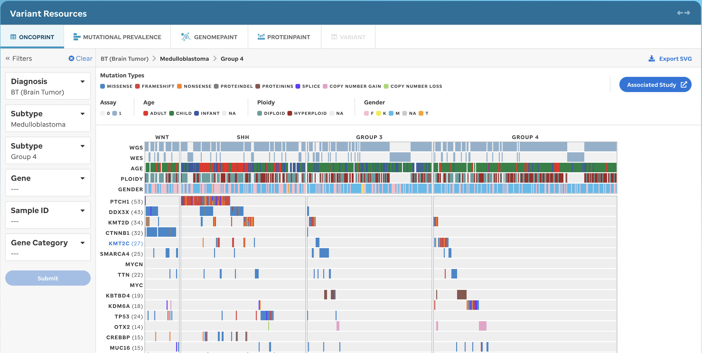
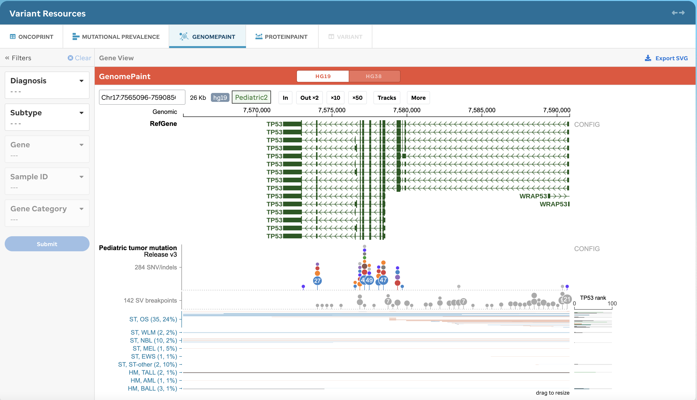
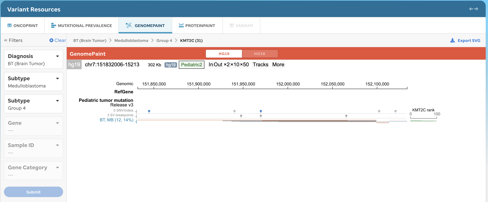
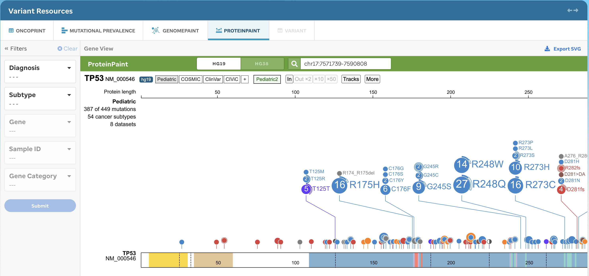

**Overview:** Analysis of samples from organizations such as St. Jude, NCI (National Cancer Institute) TARGET, DKFZ, DKTK, Shanghai Children’s Hospital, UT Southwestern, MAGIC, and Broad Institute from a protein domain 2D perspective.  

## ONCOPRINT  

A user will default to a placeholder if no subtype is selected from the Sunburst. (Figure 1). Diagnosis and Subtype are required for submitting a new oncoprint (Figure 2). Once these filters are selected and submitted, then the new oncoprint will render. The user can customize the oncoprint by (de)selecting genes and sample IDs. By altering the filters, then the other tabular views will update to this newly selected data, however, the sunburst filtering will not update. Gene Category is still under revision.

**Figure 1:** Variants: Oncoprint, without filtering. A placeholder is shown when a user directly accesses the Variant Resources: Oncoprint tab.  

**Figure 2:** Variants: Oncoprint, with filtering. This figure can be generated by following the subtype-centric user experience where a (i) subtype was selected from the sunburst landing page or (ii) a user-selected Diagnosis and Subtype filter. The filters on the left will auto-populate based on the Sunburst filter selection and can later be customized. The oncoprint is generated by ProteinPaint and therefore if a user alters the configs within the ProteinPaint UI, the filters will not update, nor will PeCan save this state in the membrane.  

!!!tip 
The dynamic oncoprints generated are not made with a curated list of genes. However, the `Associated Study` link-outs navigate the user to Visualization Community to view a similar, curated, oncoprint that may have been represented with that subset of published data in PeCan.
!!!

### ONCOPRINT METHODS
All oncoprints are generated by using ProteinPaint's mutational landscape study views. These gene lists are not curated, however, there are `Associated Study` link-outs when a subset of data is used for specific visualizations and/or publications.

### ONCOPRINT DATA
The data for these oncoprints are generated from collaborations such as DKFZ, TARGET, MAGIC, SHCMC, etc. (TBD)

## VARIANT PREVALENCE 

The user will default to a placeholder if no subtype is selected on the Sunburst (Figure 3). Once these filters are selected and submitted, then the new mutational data (i-iii) will render for that cohort:  (i) the mutation type proportion (0-1) depicted as a bar plot displaying the proportion of each mutation type (consistent ordering of mutation types for each gene); (ii) mutations are depicted in a table view displaying somatic, germline and relapse mutation breakdown; (iii) total # of mutations are depicted in a table view of the total number of patients in the cohort harboring a gene mutation with a bar plot of the total number of mutations (Figure 4).

**Figure 3:** Variants: Variant Prevalence, without filtering. A placeholder is shown when a user directly accesses the Variants: Variant Prevalence tab. 

**Figure 4:** Variant Prevalence Example, with filtering. This visualization will provide mutational data dependent upon the Diagnosis and Subtype selected. The Mutation Type legend will be the same as seen on the Oncoprint tab that was generated by ProteinPaint. 

!!!tip
For some disease sets, we have identified the most important disease pathway for the gene and have categorized them as such. This information is represented via the use of headers.
!!!

### VARIANT PREVALENCE METHODS

**Gene selection rules:**
Genes are sorted based on these items: gene_score, pathway_score, total_count and total_germline. 

For each disease, the occurrences of genes in the population of samples with that disease are counted and ranked. The higher the number of gene the smaller the rank. Rank 1 is the best. Genes with ranks > 20 get the gene_score of -1. Gene score for the genes with ranks <= 20 equals to total count of occurrences.

If a 'gene + disease' has a pathway record, then they get a pathway_score of 1000. It's simply there to add more weight to genes that have pathway records. 

Genes in this list get the gene_score of -1 : [TTN, MUC16, LPR1B, C11orf95, IGH].

We show 20 genes if no pathways are found, else 50 are returned.

**Variant selection rules:**
SNV/INDEL variant classes that are included are: [Proteinins, Intron, 3' UTR, 5' UTR, Splice Region, Frameshift, Missense, Proteindel, Splice, Exon, Nonsense]. Silent mutations are excluded. Variants with mRNA accessions that do not start with 'NM' are excluded.

CNV variant classes that are included are: [CNV Loss, CNV Gain].

All SV variant classes are considered 'SV'.

All FusionGenes variant classes are considered 'Fusion Gene'.

**Origin count rules:**

When origin is not null and value does not equal to 'germline', the record is counted towards total somatic counts. 

Relapse samples are combined with somatic samples here.

When origin is not null and value equals to 'germline', the record is counted towards total germline counts relapse, somatic, germline records and even records with null origin values are counted towards total count.

### VARIANT PREVALENCE DATA

!!!warning
Variant prevalence data won't consider the CNV records from DKTK, MAGIC and PCGP. Inferring data per gene or pathway should be analyzed thoroughly.
!!!

The variants that will be used for the Variant Prevalence page are indicate in the below table.

| dataset_label | sample_count | snv_indel_sample_count | cnv_sample_count | sv_sample_count | fusion_genes_sample_count |
| ------------- | ------------ | ---------------------- | ---------------- | --------------- | ------------------------- |
| BROAD         | 95           | 76                     | 0                | 7               | 0                         |
| DKFZ          | 576          | 551                    | 0                | 5               | 0                         |
| DKTK          | 321          | 253                    | 0                | 0               | 0                         |
| MAGIC         | 94           | 90                     | 0                | 0               | 0                         |
| PCGP          | 2339         | 1925                   | 0                | 743             | 545                       |
| SCMC          | 209          | 205                    | 0                | 196             | 58                        |
| SJCRH         | 133          | 26                     | 0                | 7               | 0                         |
| TARGET        | 1728         | 1680                   | 424              | 620             | 618                       |
| UTSMC         | 15           | 15                     | 0                | 0               | 0                         |

Table 1: Variant Prevalance. The table provides the number of samples per data set with the available variant information which are represented in PeCan. 

## GENOMEPAINT  

The user will be given a GenomePaint view, supported by ProteinPaint, for all data (Figure 5) or for the selected subtype (Figure 6) underneath the full Pediatric dataset (see Table 1). If the user alters configs using the ProteinPaint UI (e.g., coordinate view) the PeCan platform will not save this state in the membrane or update any filters across other views. Note: selecting a variant is a part of altering the configs in the ProteinPaint UI and will open separately in a Variant Page view. 

The Diagnosis and Subtype filters are only editable. When the data in filters are edited, this will update the other views to this dataset. The user is allowed to change reference genomes for this instance, but it will not change across other views, filters, or the membrane.  

**Figure 5.** GenomePaint Example, without filtering. This visualization will provide the basic GenomePaint view where the Ref Gene for the full Pediatric dataset will show. The user can navigate the UI using the GenomePaint configs. Only coordinates or gene HUGO names are accepted.  

**Figure 6.** GenomePaint Example, with filtering. This visualization will provide the basic GenomePaint view where the Ref Gene, Pediatric dataset, and the selected subtype data will show. The user can navigate the UI using the GenomePaint configs. Only coordinates or gene HUGO names are accepted.  

### GENOMEPAINT METHODS:

All documentation can be found [here](https://docs.google.com/document/d/1owXUQuqw5hBHFERm0Ria7anKtpyoPBaZY_MCiXXf5wE/edit?usp=sharing). 

### GENOMEPAINT DATA: 

 
| Ref Genome | Dataset            |
| ---------- | ------------------ |
| hg19       | Pediatric, PAN-ALL |
| hg38       | Pediatric, SJLIFE  |

**Table 2.** GenomePaint datasets. (hg19) Pediatric, PAN-ALL versus (hg38) Pediatric, SJLIFE data sets available.  

## PROTEINPAINT  

The user will be given a ProteinPaint view for all data (Figure 7) or for the subtype filtered (Figure 8) for the selected subtype underneath the full Pediatric dataset (see Table 2) If the user alters configs using the ProteinPaint UI (e.g., coordinate view) the PeCan platform will not save this state in the membrane or update any filters across other views. Note: selecting a variant is a part of altering the configs in the ProteinPaint UI and will open separately in a Variant Page view. 

The Diagnosis and Subtype filters are only editable. The user is allowed to change reference genomes for this instance, but it will not change across other views, filters, or the membrane. 

**Figure 7.** ProteinPaint Example, without filtering. This visualization will provide the basic ProteinPaint view where the full Pediatric dataset defaults. The user can navigate the UI using the ProteinPaint configs. Only coordinates or gene HUGO names are accepted. 

**Figure 8.** ProteinPaint Example, with filtering. This visualization will provide the basic ProteinPaint view where the Pediatric dataset defaults and the variants for the gene are shown with the selected subtype variants underneath the lollipop full dataset. The user can navigate the UI using the ProteinPaint configs. Only coordinates or gene HUGO names are accepted. 

### PROTEINPAINT METHODS:

All documentation can be found [here](https://docs.google.com/document/d/1owXUQuqw5hBHFERm0Ria7anKtpyoPBaZY_MCiXXf5wE/edit?usp=sharing). 

### PROTEINPAINT DATA: 

| Ref Genome | Dataset                         |
| ---------- | ------------------------------- |
| hg19       | Pediatric, COSMIC, ClinVar      |
| hg39       | Pediatric, GDC, COSMIC, ClinVar |

**Table 3.** ProteinPaint dataset. (hg19) Pediatric, COSMIC, ClinVar versus (hg38) Pediatric, GDC, COSMIC, ClinVar. 

 

## VARIANT PAGES (under scope) 

The user can access variant pages (Figure 9) by clicking, a variant in ProteinPaint, GenomePaint, by searching directly for that variant, or after signing in and submitting a PIE job. ProteinPaint and GenomePaint make a fetch to the PIE repository as soon as a variant is clicked, therefore, not all variants have Variant Pages because the pages have not yet been created. Variant Pages only exist for hg19.  

 

These pages are for use by our clinical analysts for variant classification and comprehensive data visualization as well as external professionals in the field. As one of St. Jude’s goals is to save kids worldwide, providing sufficient tools to clinicians and experts with no or little access to costly software for variant classification and visualization, would help them to better understand their patient’s cancer and potentially provide them with better care and treatment. 

**Figure 9:** Variant Example. Variant data display the implementation of a systematic variant classification in the germline and tumor context and expert-recommended sources for variant classification (i.e., ClinGen expert committees).  

### VARIANT PAGE METHOD: 

All variant pages are shown in the hg19 reference genome and also have run through our Medal Ceremony pipeline. A subset of variants have also been classified by our St. Jude Germline Committee reviewers.

### VARIANT PAGE DATA:

