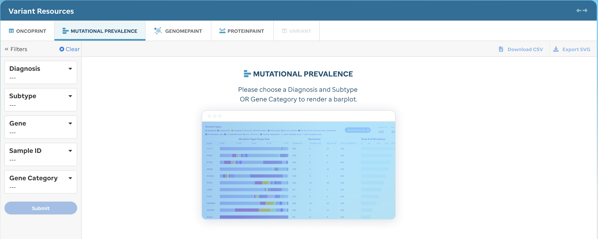
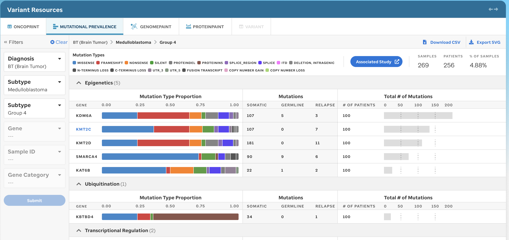
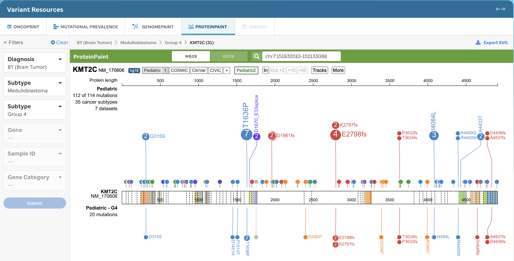

**Overview:** Perform exploratory research of variants in pediatric cancer subtypes via 5 custom interactive interfaces. Curated variants have been identified from whole-genome, whole-exome and whole-transcriptome (RNA-seq) sequencing data from 5500 samples. 

## ONCOPRINT  

A user will default to a placeholder if a diagnosis and/or subtype is not selected from the Sunburst (Figure 1). Diagnosis and/or subtype is required for generating a new oncoprint (Figure 2). For example, a user can choose to render an oncoprint for just a diagnosis: [Brain](https://pecan-v2.staging.stjude.cloud/variants/oncoprint/BT), [Solid](https://pecan-v2.staging.stjude.cloud/variants/oncoprint/ST), or [Blood(Heme)](https://pecan-v2.staging.stjude.cloud/variants/oncoprint/HM). 

Once the filters are selected and submitted, then an oncoprint will render. The user can customize the oncoprint by employing the ProteinPaint [settings](https://docs.google.com/document/d/1bx3VRdTzJDYdmt4CaU4PfHCOz5JSfTyuSFIuGTx-X2g/).

!!!tip
Updating the filters will not update the sunburst selection, if one was made but it will update the other tabular views (e.g. Variant Prevelance, GenomePaint, and/or ProteinPaint).
!!!

**Figure 1:** Variants: Oncoprint tab, without filtering. A placeholder is shown when a user directly accesses the Variants data facet.

**Figure 2:** Variants: Oncoprint tab, with filtering. This figure can be generated by following the subtype-centric user experience where a (i) diagnosis and/or subtype was selected from the sunburst landing page or (ii) a user selected a diagnosis and/or subtype filter -- the filters on the left will auto-populate based on the Sunburst filter selection and can later be customized. 

!!!tip 
The oncoprint is generated by ProteinPaint and therefore if a user alters the configs within the ProteinPaint UI (e.g, settings, sort, data, etc), the filters will not update, nor will PeCan save this state in the membrane. Clicking a gene will allow a user to view the GenomePaint view.
!!!

## VARIANT PREVELANCE 
A user will default to a placeholder if a diangosis and/or subtype is not selected from the Sunburst (Figure 3). Diagnosis and/or subtype is required for generating a new barplot (Figure 4). For example, a user can choose to render the barplot for just a diagnosis: [Brain](https://pecan-v2.staging.stjude.cloud/variants/variant-prevalence/BT), [Solid](https://pecan-v2.staging.stjude.cloud/variants/variant-prevalence/ST), or [Blood(Heme)](https://pecan-v2.staging.stjude.cloud/variants/variant-prevalence/HM). Once the filters are selected and submitted, then a new barplot will render. Once these filters are selected and submitted, then the new mutational data (i-iii) will render for that diagnosis and/or subtype selection:  (i) the mutation type proportion (0-1) depicted as a bar plot displaying the proportion of each mutation type (consistent ordering of mutation types for each gene); (ii) mutations are depicted in a table view displaying somatic and germline counts; (iii) total # of mutations are depicted as a barplot to represent the total number of variants in a given gene for that selected diagnosis and/or subtype (Figure 4).

Clicking a gene will take the user to the ProteinPaint tab.

**Figure 3:** Variants: Variant Prevelance tab, without filtering. A placeholder is shown when a user directly accesses the tab.

**Figure 4:** Variant Prevelance Example, with filtering. This visualization will provide mutational data dependent upon the diagnosis and subtype selected. The Mutation Type legend will be the same as seen on the oncoprint tab.

!!!note
For some subtypes, we have identified the most important disease pathway for the gene and have categorized them as such. This information is represented via the use of headers. They are ordered first by the pathway with the most genes. 
!!!

## GENOMEPAINT  
The user will be given a GenomePaint view, supported by ProteinPaint, for all data (Figure 5) or for the selected subtype (Figure 6) underneath the full Pediatric dataset (see our data explained section to [learn more](http://localhost:8000/docs/pecan/data/)). 

!!!warning
If the user alters configs using the ProteinPaint UI (e.g., coordinate view, reference genome) the PeCan platform will not save this state in the membrane or update any filters across other tabular views. 
!!!

!!!tip
Selecting a variant (see Figure 5) is a part of altering the configs in the ProteinPaint UI and will open separately in a Variant Page view. 
!!!

Figure 5. 

**Figure 5.** GenomePaint tab, without filtering. This visualization will provide the basic GenomePaint view where the Ref Gene for the full Pediatric dataset will show. The user can navigate the UI using the GenomePaint configs. Only coordinates or gene HUGO names are accepted.  

**Figure 6.** GenomePaint tab, with filtering. This visualization will provide the basic GenomePaint view where the Ref Gene, Pediatric dataset, and the selected subtype data will show. The user can navigate the UI using the GenomePaint configs. Only coordinates or gene HUGO names are accepted.  

## PROTEINPAINT  

The user will be given a full ProteinPaint view for the `Pediatric` dataset (Figure 7) and when the user filters by diagnosis and/or subtype, the user will see a subset of data underneath the full `Pediatric` dataset (Figure 8).

!!!warning
The diagnosis and subtype filters are only editable. The user is allowed to change reference genomes for this instance, but it will not change across other views, filters, or the membrane. 
!!!

**Figure 7.** ProteinPaint Example, without filtering. This visualization will provide the basic ProteinPaint view where the full Pediatric dataset defaults. The user can navigate the UI using the ProteinPaint configs. Only coordinates or gene HUGO names are accepted. 

**Figure 8.** ProteinPaint Example, with filtering. This visualization will provide the basic ProteinPaint view where the Pediatric dataset defaults and the variants for the gene are shown with the selected subtype variants underneath the lollipop full dataset. The user can navigate the UI using the ProteinPaint configs. Only coordinates or gene HUGO names are accepted.  

Certain variants that are classified as pathogenic or likely pathogenic (P/LP) will not only be labeled as such, but have access to navigate (Figure 9) to the Variant Details (Figure 10) to investigate futher.

[PICTURE TBD]
**Figure 9.** Accessing Variant Details from ProteinPaint. A user can navigate to the Variant Details page by selecting a (P/LP) variant within the lollipop.

## VARIANT DETAILS
A user can access variant details (Figure 10) which are individual customized variant pages displaying detailed associated genomic, clinical, classification, and observed population frequency annotation. These details are similar to the output in our PIE tool that displays the implementation of a systematic variant classification in the germline and tumor context and expert-recommended sources for variant classification (i.e., ClinGen expert committees).  

**Figure 10:** (P/LP) Variant Details Example. User interface that displays pathogenic or likely pathogneic context for recommended variant classfication. 

**Variant Details Features**

Each variant links to a detailed variant page, which integrates data from a variety of sources.

*Summary information*

The top of the page shows a summary of the variant, including its genomic and HGVS annotations, predicted effect on the protein, and somatic and germline medals. A description of the gene from Entrez follows, and a custom description or selection rationale may also be entered.

*Medal call information*

Clicking on one of the medal icons (gold, silver, bronze, unknown) or on the top of the page will show a summary of information related to the medal call.

*ProteinPaint*

This embedded ProteinPaint [Zhou et al., Nat. Genet. 2016](https://www.nature.com/articles/ng.3466) version enables visual inspection of variant recurrence, hotspots, and enrichment of loss-of-function mutation while highlighting the variant in the context of a number of pediatric datasets including PCGP. A user can toggle to the ProteinPaint tab to look at further datasets, including COSMIC and ClinVar. 

*ASHG pathogenicity classification*

Formal variant pathogenicity classification is supported by an interface implementing [ACMG guidelines]([ACMG](https://www.ncbi.nlm.nih.gov/pubmed/25741868)) ([Richards et al., Genet Med. 2015](https://www.nature.com/gim/journal/v17/n5/full/gim201530a.html)). The system will compute an appropriate pathogenicity score based on the categories detected by the pipeline. 

| Tags | Description                                                                                           |
| ---- | ----------------------------------------------------------------------------------------------------- |
| PVS1 | truncating variant in a tumor suppressor or other loss-of-function gene.                              |
| PM1  | somatic hotspot in COSMIC.                                                                            |
| PM2  | absent from ExAC non-TCGA or appearing at a frequency not greater than 0.0001.                        |
| BA1  | >5% population frequency in ExAC non-TCGA.                                                            |
| PM4  | in-frame protein insertions and deletions.                                                            |
| PS1  | amino acid comparisons made.                                                                          |
| PM5  | pathogenic variants in ClinVar or those identified by the St. Jude germline variant review committee. |

**Table 1. ASMG tags.** Definitions of ACMG tags. 

*ClinVar and allele frequency*

- Matches of the variant in ClinVar are also provided, along with predicted clinical significance and review status.

- Allele frequencies for the variant in the Pediatric Cancer Genome Project (PCGP) ([Downing et al. 2012](https://genome.cshlp.org/content/29/9/1555.full#ref-15)) (somatic and germline), NHLBI ESP 6500, [The 1000 Genomes Project Consortium 2015](https://genome.cshlp.org/content/29/9/1555.full#ref-1), and ExAC databases are presented both as fractional values and on a log10 plot. Detailed allele population breakdowns are provided for ExAC.

*Damage prediction algorithms*

Precomputed damage-prediction algorithm calls for nonsynonymous coding SNVs are presented from the dbNSFP database. Available algorithms are PolyPhen2 (HVAR), SIFT, CADD, REVEL, FATHMM, MutationAssessor, and LRT. The calls are presented as a list with entries color-coded based on the predicted severity of the result.

*Medal ceremony and linkouts*

Additional output from medal ceremony classification can also be reviewed. This is only loosely structured, additional fields here may eventually be integrated into Pecan PIE. Links are provided to relevant dbSNP entries and other information sources.

