Below is a highlight of supported data types visualized by ProteinPaint and GenomePaint within VisCom.

Code = traditional code editor view

Easy = new easy editor view

</a>| .bai | .bam | .bw | .fpkm | .gz | .tbi | .hic | .txt |
 

| Data Types                | Graph                             | Editor |
| ------------------------- | --------------------------------- | ------ |
| Heatmap                   | 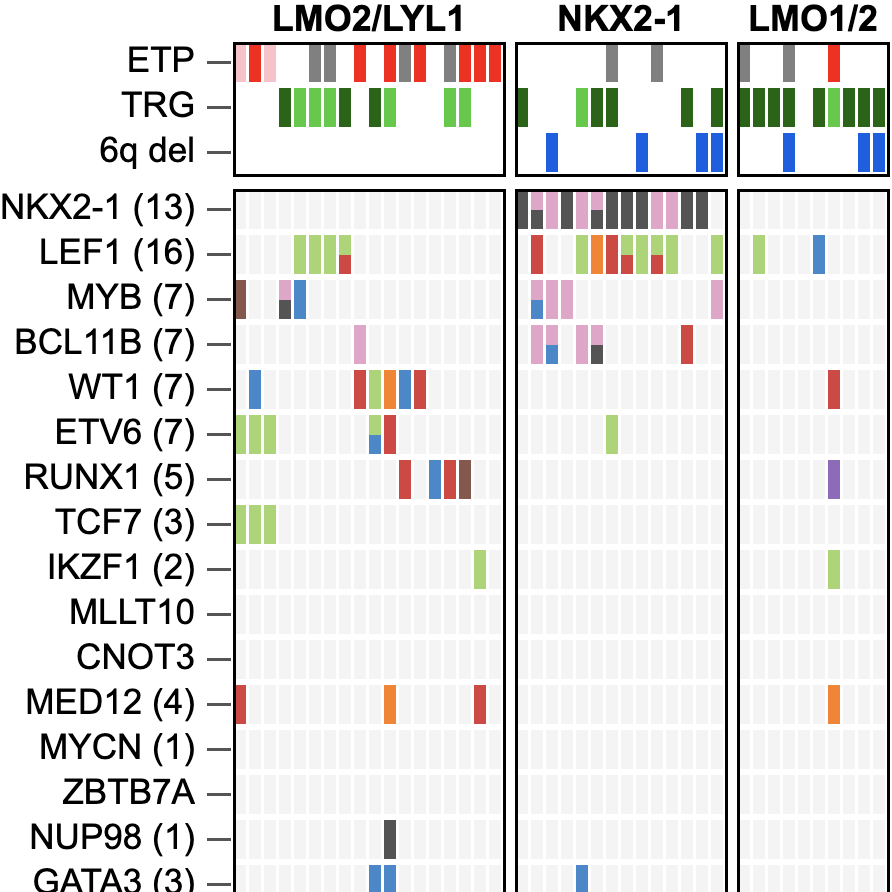         | Code   |
| Bigwig                    | 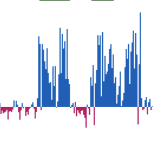          | Easy   |
| BigWig Stranded           | 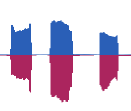 | Easy   |
| Single Cell               | 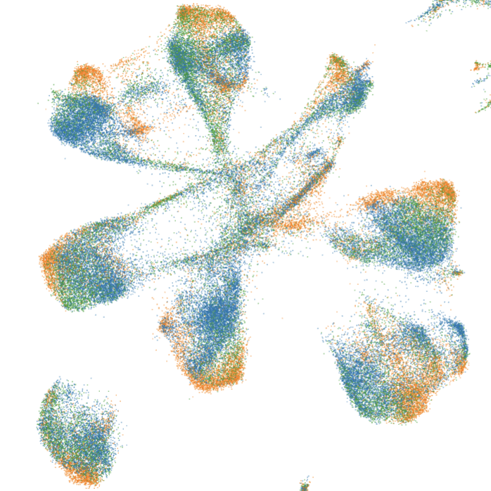      | Code   |
| PGV                       | 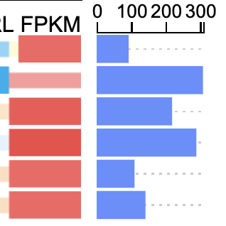             | Code   |
| MA+ VolcanPlot            | 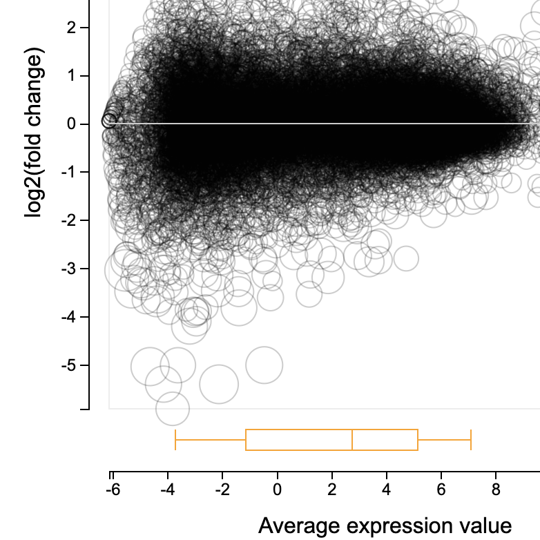            | Code   |
| Hi-C                      |              | Easy   |
| Lollipop                  | 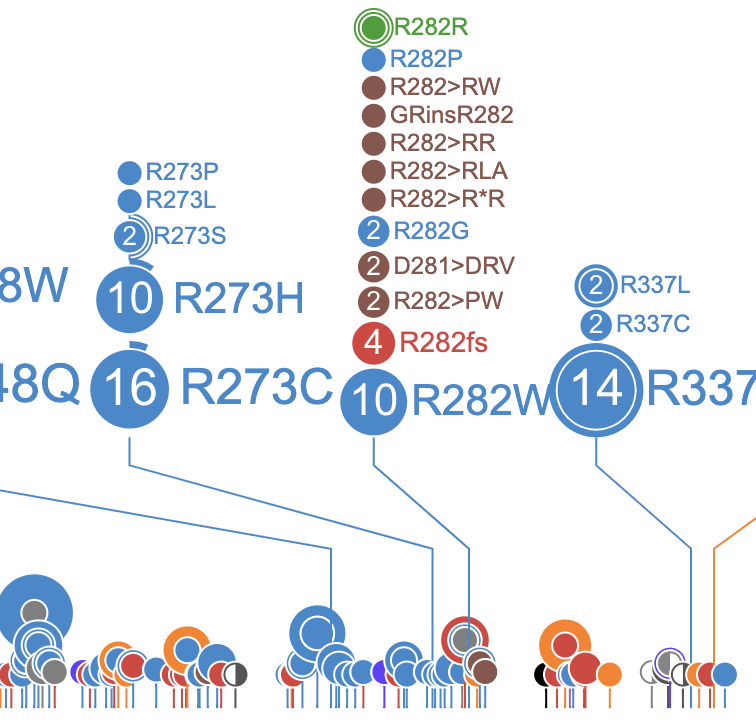        | Code   |
| FusionEditor              | 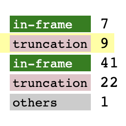   | N / A  |
| Expression Rank           | 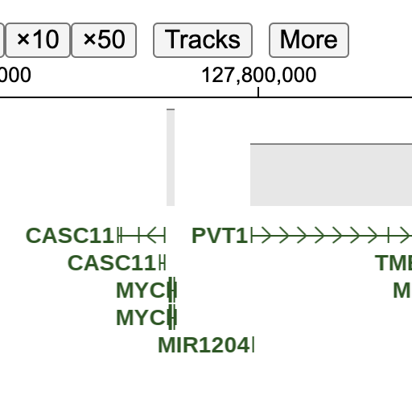         | Easy   |
| VCF                       | 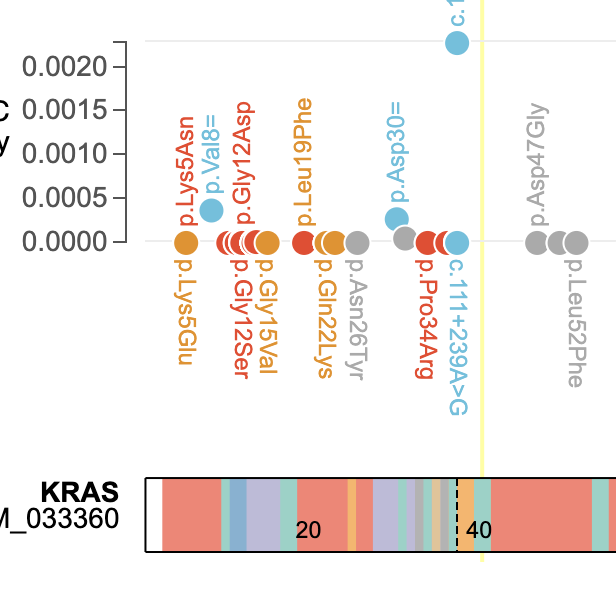             | Easy   |
| Splice junction           | 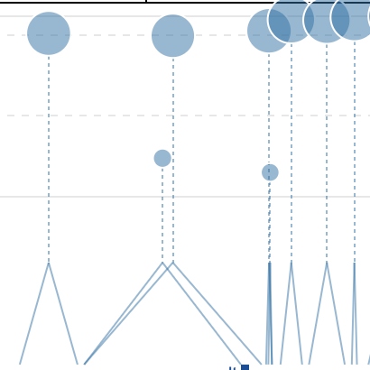        | Easy   |
| Splice junction of cohort | 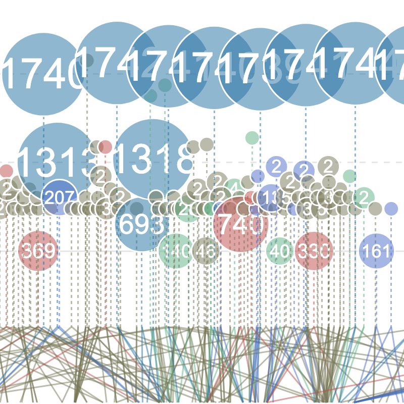 | Easy   |
| Bam                       | 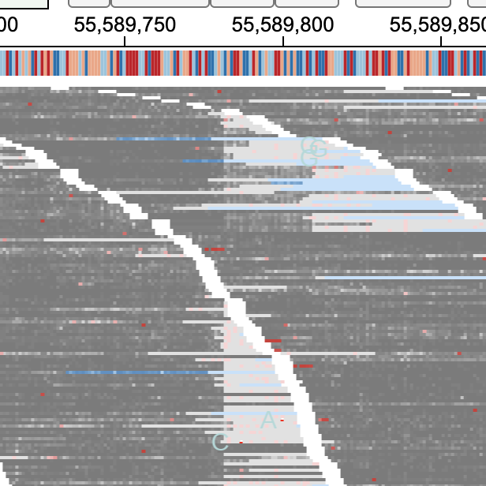             | Easy   |
| Ase                       | 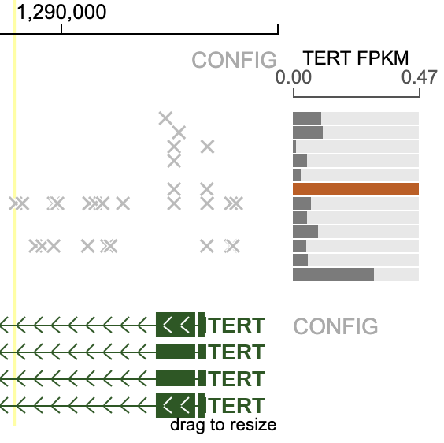             | N / A  |
| JSON BED                  | 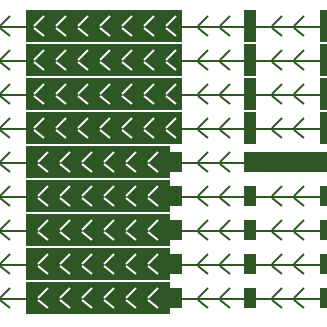            | Easy   |
| Scatterplot               | 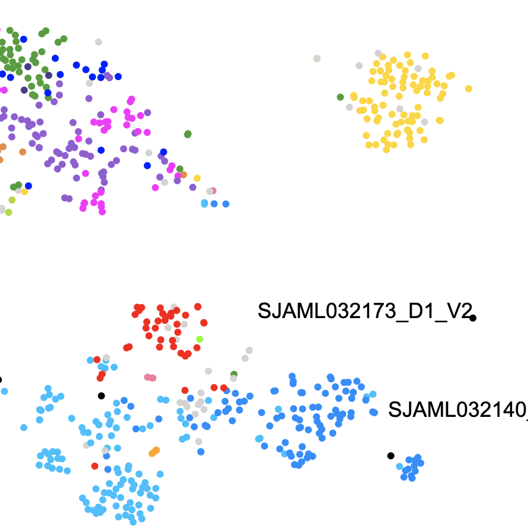     | Code   |
| Studyview                 |         | Code   |
| Aicheck                   |          | Easy   |
| MAF-timeline              |     | N / A  |
| Arc                       | 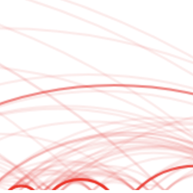             | Easy   |
| 2DMAF                     | 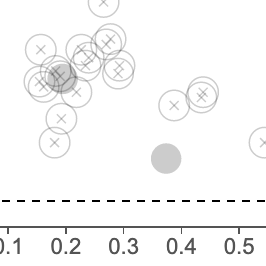           | N / A  |
| Data Facet Table          | 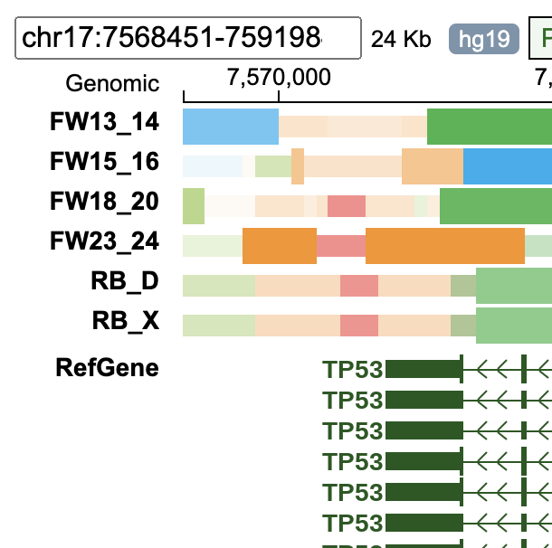          | Code   |

  *GenomePaint is supported via the code editor.

N/A = not supported at this time.
 
