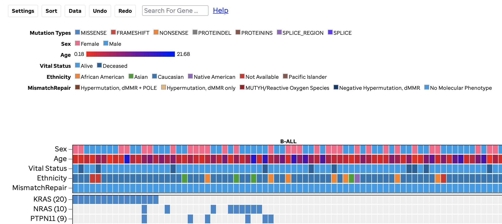
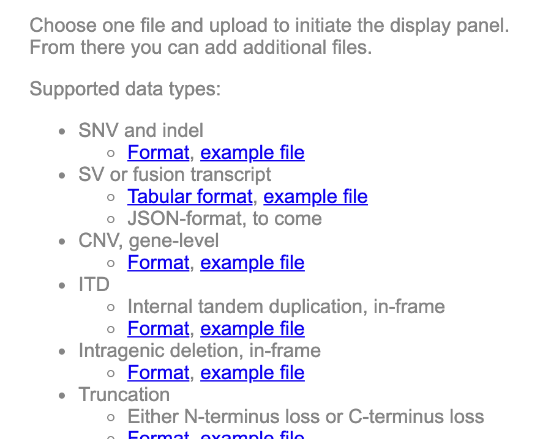

# Description 
These code block examples can be used to generate a heatmap as seen in [VisCom](https://viz.stjude.cloud/st-jude-childrens-research-hospital/visualization/genomes-for-kids-a-landscape-of-pediatric-cancer-demonstration-visualization~94).

For additional learning of each element or key please go to the heatmap [ProteinPaint Google Docs](https://docs.google.com/document/d/1JA9O4dUSwCga4Ua4DK3vbG0x9JGtKuI3j-9gjb6Tz6U/edit).

**This code block below is for snv files. If you have SV or fusion transcript, CNV, ITD, Intragenic deletion/in-frame, Truncation, then we cannot support these at this time from the url key.**
 
# URL Parameter EXAMPLE

**Be sure to update line 6, 9, and 11. Update lines 14-16 if you have JSON**
``` JS
runproteinpaint({
    host: "https://proteinpaint.stjude.org",
    holder: visualizationContainer[0],
    nobox: 1,
    noheader: true,
    genome: "hg38",
    studyview: {
        hide_navigation: 1,
        name: "name of study",
        mutationset: [{
            snvindel_url: "enter link here",
       }],
        show_heatmap: 1,
        {
            //Enter JSON here.
        } 
	}
})
```


# Path to File EXAMPLE

**Be sure to update line 6, 9, and 11. Update lines 14-16 if you have JSON**
```JS
runproteinpaint({
    host: "https://proteinpaint.stjude.org",
    holder: visualizationContainer[0],
    nobox: 1,
    noheader: true,
    genome: "hg38",
    studyview: {
        hide_navigation: 1,
        name: "name of study",
        mutationset: [{
            snvindel: "name/path_to_file.txt",
       }],
        show_heatmap: 1,
        {
            //Enter JSON here. 
        }
	}
})
```
Adding a mutation set for more than one data type (snv, copy number, fusion, etc) is expert-level customization. Currently, VisCom only allows the `snvindel_url` key, but if you have other data types, then please reach out so that we can support this for you. These would display as *Mutation Types* as seen below: 


Formats for the file types are listed below and the hyperlinks are found at the ProteinPaint mutation landscape track.


Once we can support this, it can be coded as:

```JS
"mutationset": [
        {
            "name": "DNA",
            "snvindel": "proteinpaint_demo/hg19/heatmap/snvindel",
            "fusion2": "proteinpaint_demo/hg19/heatmap/fusion.dux4.json",
            "deletion": "proteinpaint_demo/hg19/heatmap/erg.deletion",
            "ctermloss": "proteinpaint_demo/hg19/heatmap/erg.closs",
            "cnv": "proteinpaint_demo/hg19/heatmap/cnv"
        }
    ]
```  
Additionally, you may add supporting metadata directly to the JSON file. A JSON file example can be found within the mutation landscape track in ProteinPaint under the **code** tab (*see image below*). In that example, the JSON file has all the sample group information and all metadata across multiple `mutationsets` together.


If you choose to add your own JSON for the sample groups, you will follow the below:

``` JS
        heatmapJSON:{
            "samplegroup": [
              { //Enter JSON here
              }
```

To view an example of the JSON file format:
1. Example 1: Go to [https://proteinpaint.stjude.org/](https://proteinpaint.stjude.org/)
    * Select Mutation Landscape 
        * Select Example
	        * Select Code 
                * Review the JSON formatting
2. Example 2: See example 1, but then select Data tab > Advanced > Schema. This does not show all the JSON configurations of that file used but only the sample data. 
3. Example 3: Go [here](https://viz.stjude.cloud/st-jude-childrens-research-hospital/visualization/genomes-for-kids-the-scope-of-pathogenic-mutations-in-pediatric-cancer-revealed-by-comprehensive-dna-and-rna-sequencing~97) and review the code block below the visualization.
4. Example 4: Go [here](https://viz.stjude.cloud/st-jude-cloud-demo/visualization/genomes-for-kids-a-landscape-of-pediatric-cancer-demonstration-visualization~94) and review the code block below the visualization.

Furthermore, you can convert an excel sheet to JSON.  There are many ways to do this, but we recommend [BeautifyTools](https://beautifytools.com/excel-to-json-converter.php) and to debug use [https://jsonlint.com/](https://jsonlint.com/).

# Further Customization
If you want to add ProteinPaint or GenomePaint viewers to the genes, please use the below, but the files used must be specific to render correctly. If you have trouble, please reach out. 

```JS
"heatmapJSON":{
            "runPpInputTemplate": {
                "rowLabelClick": {
                "geneKey": "positionbygene",
                "useIsoform": true,
                    "template": {
                        "nobox": 1,
                        "noheader": 1,
                        "block": 1,
                        "genome": "hg19",
                        "positionbygene": "fill-in-name-of-clicked-gene",
                        "nativetracks": "refgene",
                        "tracks": [{
                            "mdsjsonurl": "enter link here"
                        }
                        ]
                    }
                }
            }
}
```

This example is used in our [oncoprint](https://viz.stjude.cloud/st-jude-childrens-research-hospital/visualization/genomes-for-kids-the-scope-of-pathogenic-mutations-in-pediatric-cancer-revealed-by-comprehensive-dna-and-rna-sequencing~97) to specifically render GenomePaint on the genes.
    
**EXAMPLE: shows full code block with url key and added genomepaint track.**

**Be sure to update lines 6, 9, 11, 27. If you have JSON this can be added, too.**

```JS
    runproteinpaint({
    host: "https://proteinpaint.stjude.org",
    holder: visualizationContainer[0],
    nobox: 1,
    noheader: true,
    genome: "hg38",
    studyview: {
        hide_navigation: 1,
        name: "G4K",
        mutationset: [{
            snvindel_url: "enter link here",
       }],
       "show_heatmap": 1,
        "heatmapJSON":{
            "runPpInputTemplate": {
                "rowLabelClick": {
                "geneKey": "positionbygene",
				"useIsoform": true,
                    "template": {
                        "nobox": 1,
                        "noheader": 1,
                        "block": 1,
                        "genome": "hg19",
                        "positionbygene": "fill-in-name-of-clicked-gene",
                        "nativetracks": "refgene",
                        "tracks": [{
                            "mdsjsonurl": "enter link here"
                        }
						]
                    }
                }
            }
        }
    }
}
```