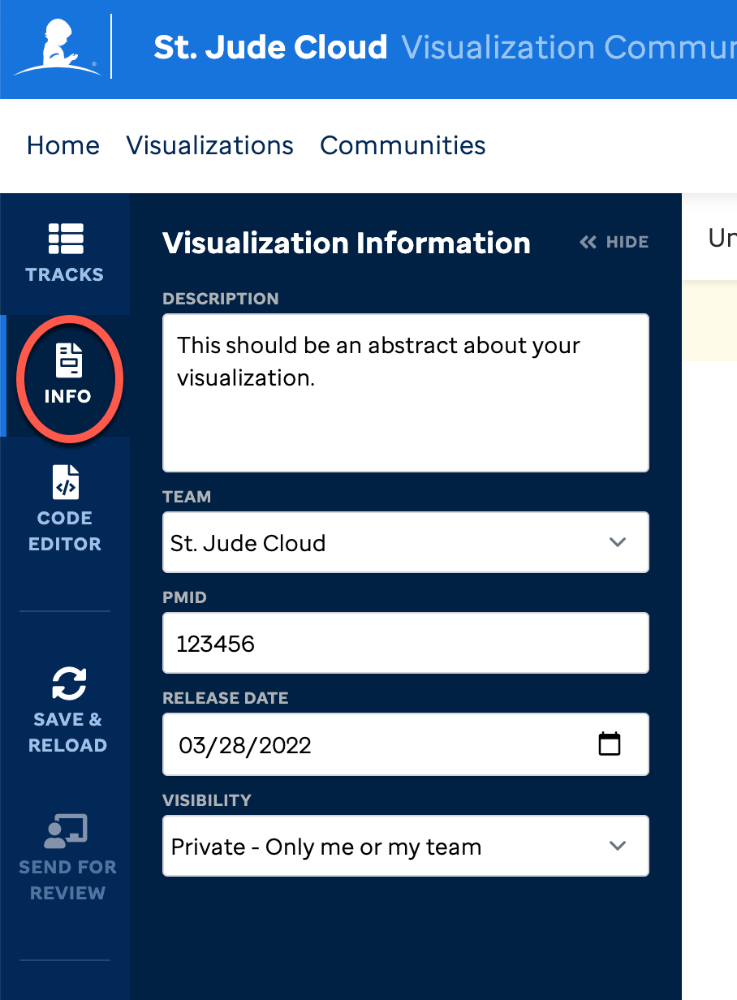
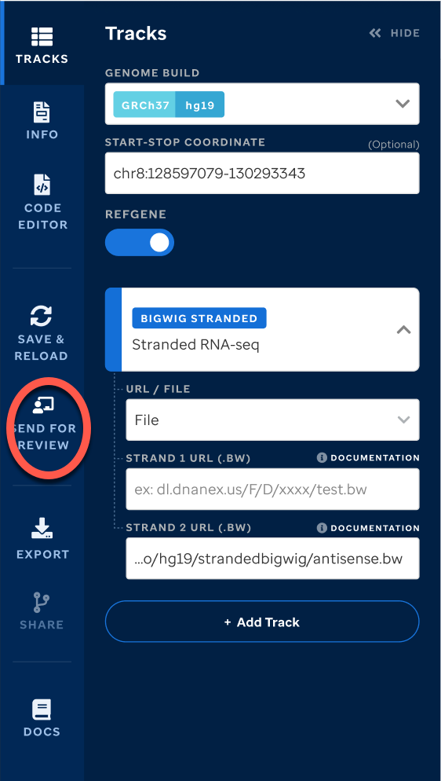
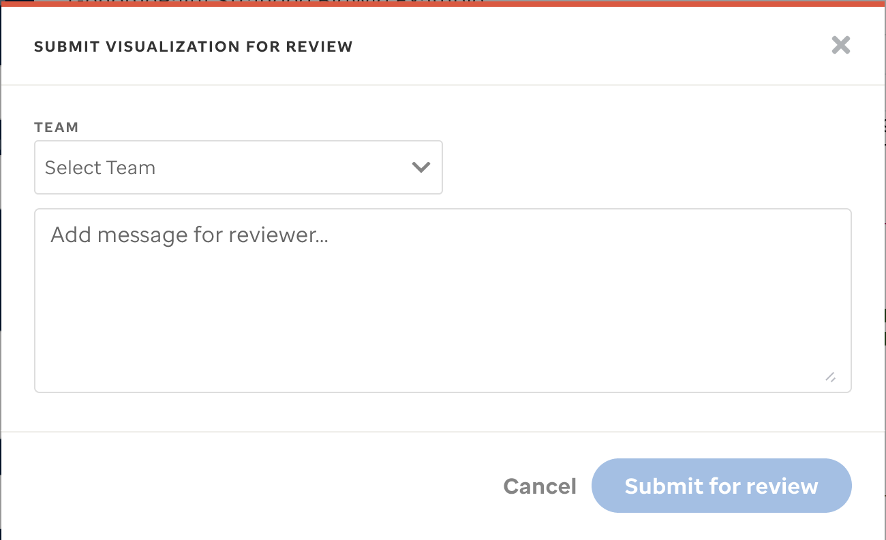
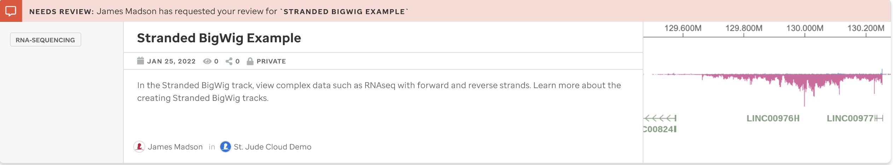
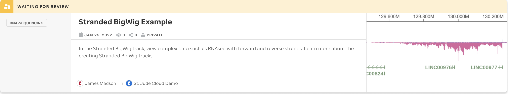
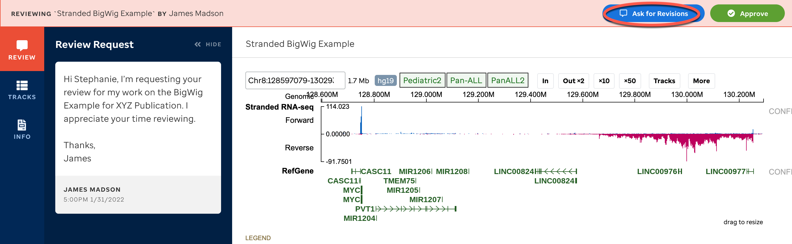
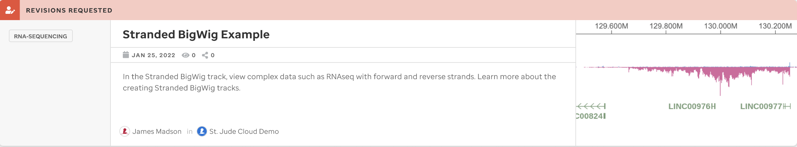
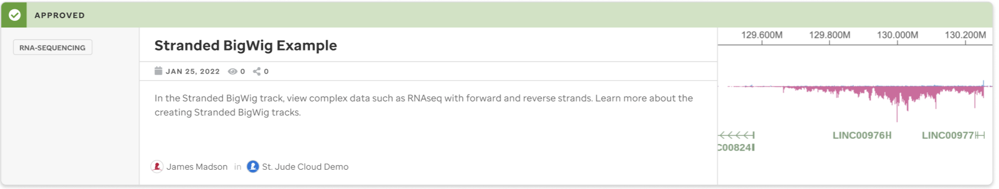
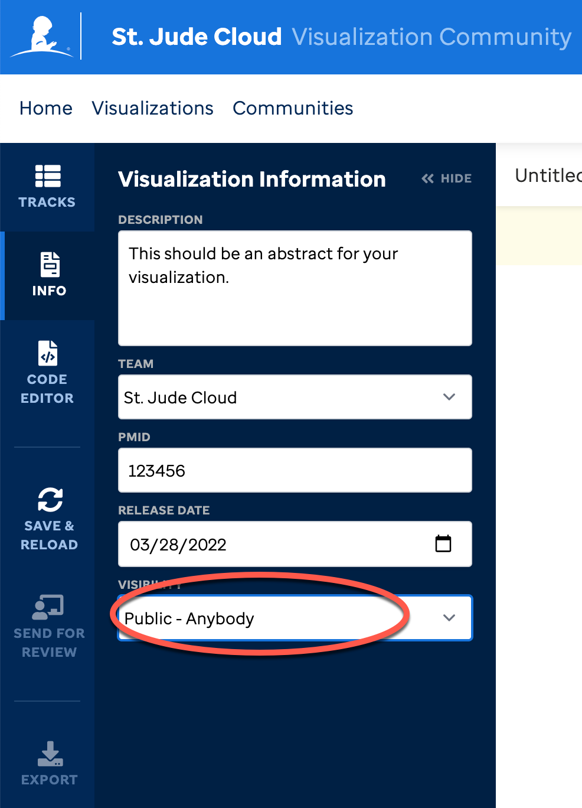

In this section, you will learn how to make a visualization public. 
By default, all visualizations are private and cannot become public until it goes through the access control approval process. You can draft visualizations in your own dashboard which will not be seen by your team until you assign the visualization a team in the Info section. This can be useful if you want to generate a template and then hand over the efforts to another colleague in your team. Just add a team in the **Info** section and anyone on the team can edit and/or send for review.

### Access Control, Approval Process

First, build your visualization and curate your view. 

Then, complete the details in the **Info** section. 

Click the **Send for Review** button in the navbar. **You cannot remove a team once you add it and save.**

Once you select this icon, it will prompt you to select a team so that the approval can be sent to the correct PI / Team Lead. 

Describe your visualization or notes you want your PI or Team Lead to review.

Your visualization header will be flagged red to indicate that it needs review. The PI or Team Lead will need to review the data in **Tracks and Info** before approving.

 When the PI or Team Lead is reviewing, it will turn yellow. 

If the PI or Team Lead needs you to make revisions, they can select this button.

Your visualization header will be flagged red to indicate that you need to make edits.

Once you are done, you must select the **Send for Review** button again to complete the process.

If the PI or Team Lead selects **Approve** then this visualization will be completed. 

Once the visualization is approved, the header will turn green.

After you complete the approval process, the ability to edit to make it public versus private will be available within the **Info** section of the visualization editor.

Once it is toggled to public, this will be shown in Visualization Community and can no longer be edited. No header will exist on the visualization and the metadata will show it is public. 

If you need to change the owner of the visualization or unpublish it, please contact [support@stjude.cloud](support@stjude.cloud). 

Please read our [terms of use](https://stjude.cloud/terms-of-use) and [privacy policy](https://stjude.cloud/privacy-policy).

