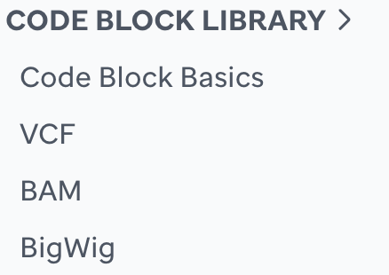
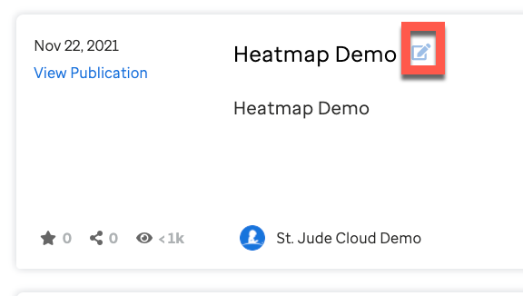

Each visualization made in your team will display in a list view. The visualization will remain private until your PI or team lead approves it in written form to [support@stjude.cloud](support@stjude.cloud). See the **Public vs. Private** chapter for more details.

## Open a New Template
When you are logged in, have navigated to teams as aforementioned in the previous section, then select a team from the list, and go to the **Visualizations** tab.


All the visualizations made by that team will populate. 

Scroll to the bottom of the list and select **Create Visualization**.


This will populate an empty template. You may select a thumbnail image to represent your visualization and fill in the following fields:
* Title
* PubMedID 
* Released Date
* Description

*If you do not select an image, our platform will render one for you by the end of the day.*


## Learn the Code Block Basics
If you need to learn more about the code block basics go [here](https://university.stjude.cloud/docs/visualization-community/basics/).

## Build Your Code

Now that you have briefly learned about how the code block works, let's select a code block for the visualization you want to create. Go to the **Code Block Library** on the left and select which data type you will be using to create your visualization.



Next, let's learn which example you need to copy and paste into the VisCom editor so that ProteinPaint can access your data and render your visualization. Each example either has a   

```JS 
file
``` 
or a
```JS
url
``` 
key. Some visualizations may have more than 1 ```url``` key; if this happens, the library example will explain what to do. 
Below describes how to get the `file` path or `url`. 

# Manage your Data
In this section, you will learn how to store your data and access it for your `runproteinpaint()`.
Follow the **Manage Your Data** chapter depending on where your data lives:

* if you have your data stored in DNAnexus. 
* if you have your data stored on your local and want to upload to DNAnexus.
* if you have your data stored on the HPC and want to move to DNAnexus.

After you select the code block, depending on where the data lives, and update the specified lines in the example, you can then save your visualization!


# Render your visualization
To render the visualization, click ‘Update Visualization’ within VisCom.

You should get a success banner.


Next, click the Go Back button at the top of the visualization template. Then, click the title of the visualization to render it.

If you have any errors due to file formatting or code block, the error will be validated and shown after you open your visualization. Therefore, go back to your list of visualizations and click the icon to edit. 



<p align="center">
    </a>Advanced customizations for</a> 
<a style="font-weight: bold"
href="https://docs.google.com/document/d/1JWKq3ScW62GISFGuJvAajXchcRenZ3HAvpaxILeGaw0/edit">ProteinPaint</a>
</a>and</a> 
<a style="font-weight: bold"  
href="https://docs.google.com/document/d/1owXUQuqw5hBHFERm0Ria7anKtpyoPBaZY_MCiXXf5wE/edit">GenomePaint</a>
 are available! </a></p>