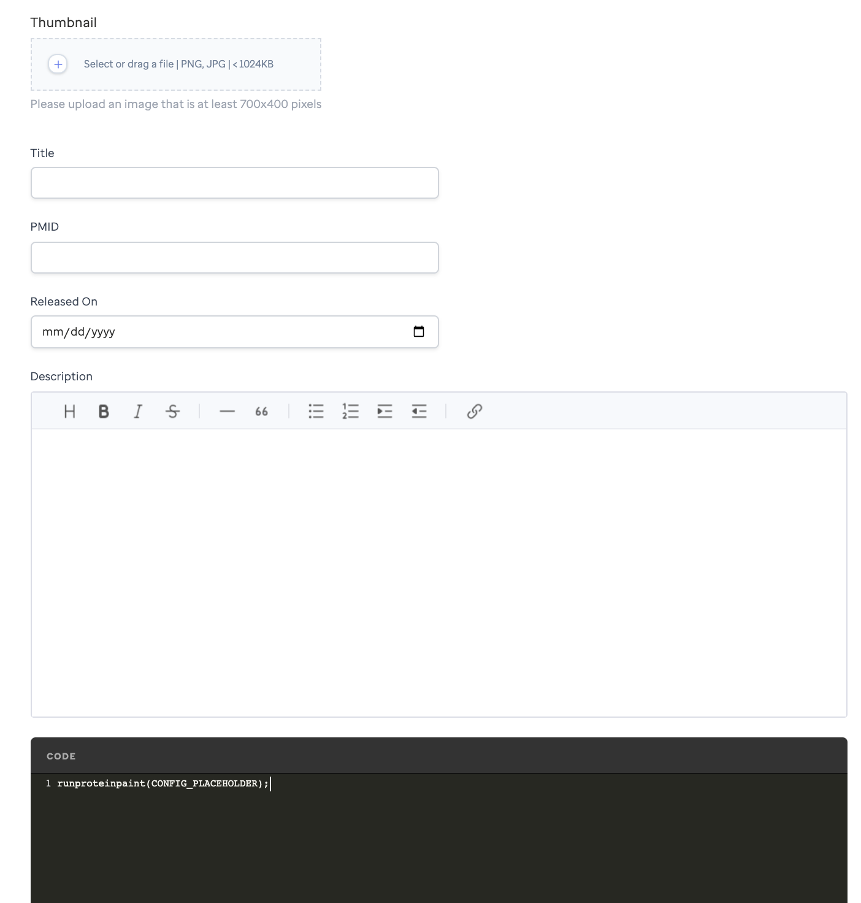
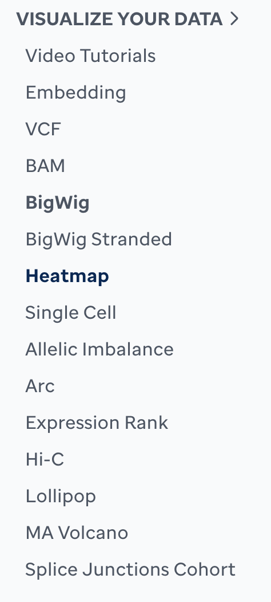

Welcome to our tutorials where we guide you step-by-step to learn how to run ProteinPaint from within Visualization Community [VisCom]([demo collection](https://viz.stjude.cloud/st-jude-cloud-demo/collection/proteinpaint-and-genomepaint-examples~7)) to create your own visualization(s). 

Follow along with our written tutorial or watch our video series. Then explore each visualization code block in our library. If you have any questions, please reach out to [support@stjude.cloud](support@stjude.cloud). 

For additional learning of each element or key please go to the [ProteinPaint Google Docs](https://docs.google.com/document/d/1JWKq3ScW62GISFGuJvAajXchcRenZ3HAvpaxILeGaw0/edit)


# Getting Started 
First, go to viz.stjude.cloud/signin. Once you have completed the authentication, contact support@stjude.cloud to be added to a team. 

Login to VisCom and navigate to the right side of the navigation bar and click on **Teams**.
 

This will default a list of your teams. Select **Visualizations** to create a new visualization template.


All the visualizations made for that team will populate. Scroll to the bottom and select **Create Visualization** to render a template. 


Now you are able to fill in your visualization template. You may select a thumbnail image to represent your visualization and fill in a Title, PubMed ID, Released Date, and Description. 


Watch our video tutorial to learn more **[add video here]**


# Creating your Visualization 
For using VisCom's editor, a run proteinpaint () must be used, which uses javascript. To find more details about this software please see the [ProteinPaint Google Docs](https://docs.google.com/document/d/1JWKq3ScW62GISFGuJvAajXchcRenZ3HAvpaxILeGaw0/edit) for help. 

Let's cover the basics of the code block.

!!!tip
* ProteinPaint is case sensitive.
* The code block has static parameters for many of the visualizations. See below an example:
!!!

```JS
runproteinpaint({
    host: "https://proteinpaint.stjude.org",
    holder: document.getElementById('a'),
    parseurl: true,
    block: true,
    nobox: 1,
    noheader: 1,
    nativetracks: "RefGene",
```

```Genome``` will be dependent on your species that you are using. Sometimes this is replaced with ```postion```. 

``` JS
genome: hg18
```

```Tracks``` or ```Studyview``` will contain different keys. This is where you will ```name``` your study or track and point ProteinPaint to where your data lives. See example below:

``` JS
studyview: {
        hide_navigation: 1,
        name: "test",
        mutationset: [{
            snvindel_url: "enter link here",
       }],
        show_heatmap: 1,
	}
})

```
For heatmaps, you may add additional customization by adding JSON.
```JS
        heatmapJSON:{
            "samplegroup": [
              {
              }
```

Watch our video to learn more **[add video here]**

Now that you learned about how the code block works, let's select a code block for the visualization you want to create. Go to the list on the left and copy/paste the code block into VisCom's editor on the template, based on where your data lives. 


Next, let's learn how to point ProteinPaint to where your data lives so you know how to update the ```file``` or ```url``` parameter. Some visualizations may have more than 1 ```url``` parameter. This will be defined in that visualization overview. 

## When data is hosted in the cloud using DNAnexus:
Sign in to [DNAnexus](cloud.stjude.org) and create or open an existing project. If you need to upload your files to DNAnexus or are new to DNAnexus, please refer to the tutorial found [here](https://university.stjude.cloud/docs/genomics-platform/managing-data/upload-dnanexus/. Then, once you are ready, locate your data in your DNAnexus project.

On the right of the file within your project, click the 3 dot menu for your file. Then, select download in the dropdown. This will prompt a GET URL link. Click the 'Get URL' to copy the temporary link. If you need more assistance, follow the tutorial found [here](https://university.stjude.cloud/docs/genomics-platform/managing-data/upload-dnanexus/). 

!!!warning 
This link allows others to access this file and is only available for 24h.
!!!

Now, paste the link from DNAnexus into your ```url``` parameter in the code block you copied for your visualization. 

!!!tip
* Other free storage software is compatible to use with the url parameter.
* Follow the same DNAnexus steps, but replace the URL line accordingly.
!!!

To learn more about how to find the url parameter watch this [video].

# When data is hosted on the HPC
If you do not have access to the HPC, you will need to email [Information Services](https://stjude.service-now.com/sp?id=sc_cat_item&sys_id=bb8437fd1b026c109057f2ff034bcb07&sysparm_category=812f8e8d4fabf2444ce80ad14210c7bc) to gain access. 

When you have access to the HPC, you will want to open your terminal and login ```ssh hpc.stjude.org```. If you have not already, upload your data onto the HPC. Next, locate your data in your directory. Then, find the path to this file. Copy and paste the path to the ```file``` parameter in your code block. 

Example: ~/tp/ssandor/g4kv2

To learn more on how to find your data on the HPC watch this [video].

**Coming soon:** how to run ProteinPaint locally with a license

**Coming soon:** how to run ProteinPaint using a url parameter from an external server

# Render your visualization
In order to render the visualization, click ‘Update Visualization’ within VisCom.

Next, click the ‘Go Back’ button in VisCom. Then, click the hyperlink icon next to your visualization to render it.

If you have any errors due to file formatting or within the ```runproteinpaint``` () the error will be validated and shown.


<p align="center">
    </a>Advanced customizations for</a> 
<a style="font-weight: bold"
href="https://docs.google.com/document/d/1JWKq3ScW62GISFGuJvAajXchcRenZ3HAvpaxILeGaw0/edit">ProteinPaint</a>
</a>and</a> 
<a style="font-weight: bold"  
href="https://docs.google.com/document/d/1owXUQuqw5hBHFERm0Ria7anKtpyoPBaZY_MCiXXf5wE/edit">GenomePaint</a>
 are available! </a></p>
